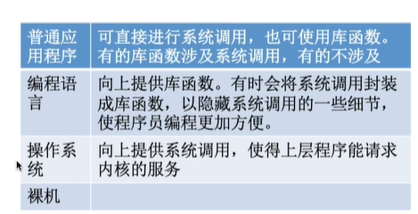

## 1.3_1操作系统运行机制

* 预备知识：
  程序是如何运行的。
  `C语言代码`通过编译器，编译为`机器指令（二进制）`。
  程序运行的过程就是**CPU执行一条有一条机器指令的过程。**
  `指令`是CPU能够识别、执行的最基本命令。

  此处指令，不同于终端中的命令，终端中的命令是`交互式命令接口`。
  这里的指令，指的是二进制的机器指令。

* 区分两种程序：
  内核程序、应用程序。
  应用程序就是在OS上方跑的应用，比如QQ,WX。
  内核程序：大公司里面程序员负责实现操作系统的时候写的程序。简称'内核'。

  `内核`是操作系统里面最核心的部分，也是最接近硬件的部分。
  操作系统最重要的工作，是资源管理，通过内核来完成。

* 特权指令和非特权指令：
  内核程序中可以出现特权指令(比如内存清零指令)，应用程序中不可以出现特权指令。

  CPU**在设计和生产的时候，就可以自己来识别**一条指令是特权指令还是非特权指令。但是这也只意味着他知道当前指令是什么类型，仅此而已。他还需要其他的机制来判断当前可不可以运行这一条指令。

* 问题：CPU如何区分正在运行的程序是内核程序OR 应用程序？

  **两种状态：内核态、用户态**。
  CPU处于内核态时，说明正在运行的是内核程序，只能够执行特权指令。
  CPU处于用户态时，说明正在运行的时应用程序，只能执行非特权指令。

  cpu通过**程序状态寄存器`PSW`**来区分自己处于哪一种状态，1表示内核态，0表示用户态。
  别名：内核态=核心态=管态 用户态=目态

* CPU如何实现状态的切换：
  用实际例子来解释：
  开机，OS需要进行初始化工作，是需要运行内核程序，此时时内核态。
  开机后，运行一个应用程序。
  如果想要运行，**内核程序 会使用一条指令**把PSW更改为用户态。（完成了状态的切换），之后内核就让出CPU，让应用程序使用。这时候，处于用户态。

  如果，有一个黑客此时植入特权指令：
  CPU可以自动识别出，这是特权指令，需要内核态才能运行，但是（检查PSW寄存器）发现当前是用户态。
  CPU发现一件非法事件：应用程序想要运行特权指令。这个事件会引起一个**中断信号。**
  CPU检测到中断信号之后，会强行转变为内核态，并且停止运行当前程序，与之代替的，会运行处理当前中断信号的内核程序。
  处理完了之后，内核重新把使用权还给应用程序。

  所以内核态->用户态的切换，就是运行一条指令，使得PSW变化为用户态。
  用户态->内核态：由'中断'引发，硬件自动完成变换状态，触发中断信号内核会强行夺回CPU使用
  权。

  

## 1.3_2中断和异常

* 中断的作用：
  CPU会运行内核程序+应用程序。
  一个应用程序开始运行，获得cpu的使用权，会一直运行，直到发生中断。
  **中断**是让os内核夺回cpu使用权的唯一途径。
  中断会让cpu从用户态变为内核态。

  所以内核态->用户态的切换，就是运行一条指令，使得PSW变化为用户态。
  用户态->内核态：由'中断'引发，硬件自动完成变换状态，触发中断信号内核会强行夺回CPU使用

* 中断的类型：内中断和外中断。
  内中断：与当前指令有关，中断信号来源于cpu内部。
  外中断：与当前指令无关，中断信号来源于cpu外部。

  内中断例子：
  与当前的指令有关，中断信号来源于cpu内部。
  例子：1.视图在用户态下执行特权指令、2.执行除法指令时除数是0.
  当前的指令非法 -> 引发一个中断信号。	
  **陷入指令**：
  3.一个应用程序运行在用户态，但是如果想要请求操作系统内核的服务，此时会执行一条特殊的指令（陷入指令），会引发内部的中断信号。

  
  **陷入指令不是特权指令，因为陷入指令运行在用户态。**

* 外中断例子：
  和当前指令无关。
  例子：1.时钟中断：
  **两个应用程序如何在cpu上面并发运行：**

  设备：**时钟部件**,作用：每次间隔一个时间片，比如(50ms),就会给cpu发送一个中断信号。
  首先cpu运行应用程序1，在用户态。50ms时，时钟部件给cpu发送中断信号。（因为这个中断信号和cpu当前执行的指令没有关系，来源于cpu外部，因此是外中断）。
  CPU在收到中断信号之后，暂停应用程序，开始运行内核程序，转为内核态，开始运行内核程序来处理刚刚的中断信号，处理的时候发现，刚刚已经应用程序1使用了50ms,之后要运行应用程序2。然后内核会交出cpu的使用权让给应用程序2，cpu开始运行应用程序2。这个时候又切换回用户态。如此循环。。。

  例子2：I/O设备，由输入输出发来的中断信号。打印机打完之后发送中断信号，然后转换为内核态，运行内核程序处理这个中断信号。

* 内中断又称为异常、例外。

  外中断又称为中断。

* 对于内中断继续细分三类：
  
  **陷入：**由陷入指令引发的异常，是系统故意引发的，想要请求系统的操作，也是系统调用实现的原理。
  **故障：**是由于错误条件引起的，可能被内核程序修复的一种异常。在内核程序修改完故障之后还会把cpu使用权还给应用程序。比如缺页故障。
  **终止：**由指明错误引起的，一般内核程序没有办法修复，所以不会再把使用权还给应用程序，一般会直接把应用程序终止掉。比如整数除0，非法使用特权指令。

 

* 中断机制的基本原理：
  不同的中断信号，需要使用不同的中断处理程序来处理。
  会根据中断信号的类型查询**中断向量表**，以此来找到相应的中断处理程序在内存中的位置。
  

* 知识点回顾
  

中断机制的基本实现原理：

* 检查中断信号：
  内中断：CPU在执行指令的时候就会检查是够有异常发生。
  外中断：在每一个指令周期末尾，cpu都会检查是否有外中断信号需要进行处理。
* 找到了中断信号之后，借助中断向量表，找到对应的中断处理程序。

## 1.3_3 系统调用

* 什么是系统调用：
  os作为用户和计算机硬件的接口，需要向上提供一些简单易用的服务。包括命令接口和程序接口。向上提供的服务中，给用户的就是命令接口，给应用程序的就是程序接口（系统调用）

  其中程序接口就是由一组**系统调用**组成。

  **系统调用：**
  是os提供给应用程序使用的接口，可以理解为一种可以让应用程序调用的特殊函数。**应用程序可以通过系统调用来请求操作系统内核的服务。**

* 系统调用和库函数的区别：

  普通的应用程序 可以直接进行系统调用，也可以使用库函数。

  有的库函数会涉及系统调用：比如创建新文件的函数。有的不涉及系统调用，比如取abs的函数。

  操作系统往上面提供系统调用的接口，是的上层程序能够请求内核的服务。在操作系统上方就是编程语言，有时候一棵把系统调用封装成库函数。
  

* 为什么系统调用是必须的？

  或者说系统调用的功能是什么：
  操作系统的内核对`共享资源`进行统一的管理，并且往上面提供系统调用。因此对于用户进场，想要使用共享资源，只能通过系统调用向os内核发出请求，然后内核会对各个请求进行协调处理。

  如果不这样做，就有可能会出现，用wps打印和word打印之后，如果两个应用程序都使用到了打印机的资源，打印的东西会直接乱掉。

* 提供了哪些系统调用：
  
  操作系统 给应用程序提供了程序接口、也就是系统调用。操作系统管理共享资源，因此凡是和共享资源有关的功能，都需要通过系统调用的方式向os内核提出服务请求。这样可以保证系统的稳定性和安全性。

* 系统调用都有哪些过程：

  传递系统调用参数->执行陷入指令`用户态`->执行相应的内核请求程序处理系统调用`核心态`->返回应用程序。

  如果`应用程序`想要某一种系统调用，会通过传参指令给cpu的寄存器中传递参数，可能一个传参指令，也可能多个。
  之后应用程序执行`陷入指令`，引发内中断，然后CPU转入相应的中断处理程序，这里的`中断处理程序`就是系统调用的入口程序。
  之后这个系统调用的入口程序，会检查cpu的参数确定需要哪种系统调用服务，之后入口程序再调用对应的系统调用处理程序，系统调用的处理程序可能还需要看cpu里面的参数来确定到底需要哪种服务，处理完了之后，又会进入用户态。
  继续运行应用程序。

  

  注意：！陷入指令是在用户态执行的，不是特权指令。引发内中断进入核心态。
  ！！`发出系统调用请求`是在`用户态`，`对系统调用的相应处理`是在`核心态`下进行。

  

  陷入指令又称为TRAP指令，访管指令。

  

## 1.4_操作系统体系结构

这里内容暂时略过。

## 1.5_操作系统引导

* 什么是操作系统引导？开机的时候，操作系统怎么运行起来。

* 磁盘里有哪些和操作系统引导有关的数据？
  如果新买了一个磁盘，是全部空的。在磁盘里面安装了操作系统之后：

  
  操作系统安装在C盘。
  前面有一个区，是主引导记录`MBR`，包括磁盘引导程序和分区表。分区表说明了每一个盘、分区的位置和大小。
  C盘里面：
  

  含有根目录，是双击打开C盘看到的东西。
  含有引导记录`PBR`，负责找到`启动管理器。`

  C盘里面安装的操作系统是怎么一步一步启动的？

  操作系统的数据需要放到主存里面。

  > 补充知识：计算机的主存由RAM,ROM两部分组成。
  > RAM，就是我们平时说的电脑内存。
  > ROM，存储BIOS，$Basic\  Input/Output\ System$.
  > 基本输入输出系统，有很多程序，比如ROM引导程序，又称为自举程序。

RAM，关机之后，数据会清空，但是ROM里面不会丢失。

* 开机过程：
  * 开机之后，cpu在主存特定位置找到`ROM中的引导程序`,取出指令，然后执行程序里面指令。
  * 执行ROM中的引导程序之后：就会让cpu把磁盘的`主引导记录`读入内存(RAM),主引导记录里面有分区表和磁盘引导程序。同时会执行主存里面的磁盘引导程序，扫描分区表。
  * 从安装了操作系统的分区中读入分区引导记录，执行其中的程序。然后找到C盘的位置，就可以读入C盘的PBR，之后cpu可以执行引导记录里面的程序，执行这个程序之后，就可以找到启动管理器。（这个启动管理器，通常在C盘根目录下面）。
  * 找到了`完整的操作系统初始化程序`，也就是`启动管理器`，找到之后cpu就可以执行启动管理程序，然后就可以完成操作系统初始化的一系列工作了。
    
    

