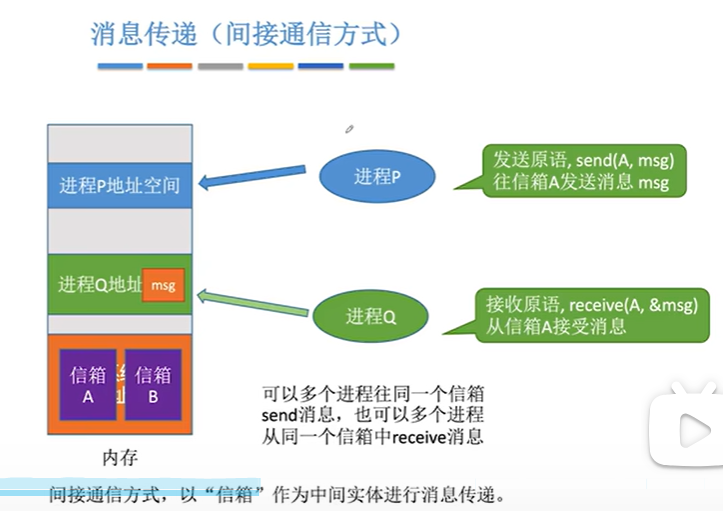

# 处理机管理

## 2.1_1_进程的概念组成

* 进程的概念

  程序：是**静态**的，就是一个存放在磁盘里面的可执行文件，是一系列的指令集合。这里的指令，不是终端里面的指令，是直接cpu可以运行的指令。

  进程：是**动态**的，是程序的一次执行过程。

  思考：os是管理者，怎么区分各个进程？
  os在创建进程的时候，会给进程分配一个**唯一的，不会重复**的`PID`.
  每一次新建的时候，都会创建一个新的进程。有时候我现在运行qq,马上关掉再运行的pid可能都是不一样的，和os内的分配pid的策略有关系，可能都是直接加一。

  操作系统不仅记录pid，还有`进程所属用户UID`，记录分配了哪些资源（使用哪些文件、哪些I/O设备），记录进程的运行情况（比如cpu使用时间、磁盘使用情况、网络流量使用），这些信息都包勋在数据结构`PCB 进程控制块`里面。
  **总之，os对进程管理的一些信息都会放到PCB里面。**

* **PCB是进程存在的唯一标志，当进程被创建的时候，os为其创建PCB，当进程结束的时候,os会回收PCB。**

  PCB存储的信息：

  

* 进程的组成：
  PCB：进程描述信息，进程控制和管理信息，资源分配清单，处理机相关信息。
  程序段：程序的代码（是指令序列）
  数据段：运行过程中产生的各种数据（比如程序中定义的变量）。

  **PCB是给os使用的，程序段、数据段是给进程自己使用的。**

* 细化，程序是如何运行的：
  写完一个程序之后，经过编译、链接，会形成一个可执行文件exe，平时在磁盘中存放，（其实就是刚刚说的指令序列），运行之前，需要从`硬盘`读入到`内存`中，并且os会分配一个进程，建立相对应的pcb，建立对应的**程序段来存储指令序列**。进程执行的过程，就是从程序段中一条一条读入指令，并且执行。
  执行指令中可能有一些中间数据，比如变量x，所以还要有数据段，来存储再运行过程中产生的各种数据。

  一个**进程实体**由**PCB、程序段、数据段**组成。

  在理解的角度：我们可以理解进程实体是某一个时刻，进程的照片。
  因为进程是动态的，然而进程实体是静态的。
  而且正式因为进程是动态的，也就意味着，进程实体是在不断变化的。

* **给进程下定义：**
  ==进程是进程实体的运行过程==，是系统进行`资源分配`和`调度`的独立单位。

  调度，就是指os管理进程让cpu运行的过程。
  PCB是进程存在的唯一标志。

  运行三个qq，**PCB、数据段各不相同，但是程序端的内容是相同的**，因为运行的是3个QQ.

* 进程的特征：（只需要理解，不需要死记硬背）。
  动态性：是动态的产生、变化和消亡的。
  并发性：多个进程可以并发执行。
  独立性：进程是够独立运行，独立获得资源，独立接受调度的基本单位
  异步性：（之后会细说）
  结构性：是指每一个进程都有pcb\数据段\程序段结构。

  

* 进程是独立获得资源的基本单位。
  在引入线程之后，就不是接受调度的基本单位了。
  但是还是获得资源的基本单位。

## 2.1_2_进程的状态和转换、进程的组织方式

* 平时的程序`可执行文件`存放在硬盘里面，运行的时候需要把她的内容调入内存，同时os为其建立对应的pcb，也就是建立对应的进程。

  进程被创建的这个过程，进程处于的状态就是 `创建状态`。
  **在创建状态，os会为进程分配需要的资源、初始化PCB。**

  完成创建之后，进入新的状态，`就绪态`。
  处于就绪态的进程，已经具备了运行的条件，之不过此时没有空闲的CPU，所以暂时不运行。
  一个系统中同一时刻可能有很多处于`就绪态`的进程，当CPU空闲，就会选择一个进行运行。

  如果一个进程正在CPU上面运行，就处于`运行态`。
  进程的运行，代表着cpu在运行进程背后的程序，**也就是执行指令序列。**

  在进程运行的时候，可能会 **请求等待某一个事件的发生**，比如有时候需要等待打印机资源等等。
  因为等待这个事件，所以这个事件发生之前，都没办法运行，此时OS会让这个状态下的进程进入`阻塞态`。OS会剥夺CPU的使用权。

  之后如果打印机空闲下来之后，如果OS 把这个打印机分配给了刚刚 因为等待打印机资源而进入`阻塞态`的进程，这个进程因为现在有了打印机的资源，所以转变为`就绪态`。（in other words ，阻塞态的进程等待的事件发生了之后，这个进程就转变为了`就绪态`）。

  另外一件事情：
  如果一个正在运行的程序，运行结束了，就会发出exit系统调用，请求OS终止这个进程。此时这个进程会处于`终止态`，OS会让这个进程下CPU，回收内存空间等资源、回收PCB。
  终止进程的工作完成之后，进程就完全消失了。

  图片重新描述这个过程：

  

  1.运行态$\rightarrow$阻塞态是一种进程本身做出的`主动行为`。
  2.阻塞态$\rightarrow$就绪态是一种被动行为，不受进程本身控制。

  强调有的时候，可以直接从运行态转变为就绪态。比如在os给进程分配的时间片用完的时候，分时处理系统中。

* 进程的状态：
  

  Q：操作系统怎么记录进程状态？
  `在进程PCB中有一个变量state，来存储当前的状态，1是创建态，2是就绪态，3是运行...`

  **为了对同一状态下的各个进程进行统一的管理，操作系统会把各个进程的PCB组织起来。**

  如何组织？

* 进程的组织方式：（组织方式简单了解一下就行）

  * 进程的组织—链接方式：
    是指OS会管理一系列队列，每一个队列都会指向响应状态的PCB，比如`就绪队列指针`就会指向`当前处于就绪态的进程`，如下图所示，通常会把优先级高的进程放在队头。
    
    有时候阻塞队列会因为阻塞原因继续细分：
    
  * 索引方式：
    OS给各个状态的进程建立索引表，每一个表项会指向对应的PCB。如图：
    

**大多数OS都采用 链接方式管理PCB 进行进程的组织。**

* 总结：
  

## 2.1_3_进程控制(更多的是理解性质的知识)

**进程控制** 就是为了 **实现进程的转换**，在这个过程中OS要做什么事情，就是这一节要讨论的问题。

* 进程控制的功能：对OS中所有进程的功能进行有效的管理，具有创建新进程、撤销已经有的进程、实现状态转换等功能。
  简化理解：**进程控制就是要实现进程的转换。**

* 

* 如何实现进程控制？
  需要使用`原语`来实现。

  **原语的概念：**
  OS中有一种特殊的程序叫原语。
  **原语程序具有原子性**，这段程序的执行中间不能被中断，必须一气呵成。

  可以理解为，实现进程转换的操作，必须不能中断的完成。Q：为什么？

  * 为什么要用`原语`:
    如果不能一次完成，就有可能会出现OS中一些关键结构信息不统一的情况，影响OS进行别的管理工作。
    比如：
    
    一个进程从`阻塞态`转变为`就绪态`，需要进行 状态变量的修改 和 队列的转换（从阻塞队列转换为就绪队列）两件事情。如果完成了一件事情之后，收到了中断信号，那么此时就会出现这种情况：当前进程中的 state表示当前进程为就绪状态，但是当前进程并没有处于就绪队列中，反而是阻塞队列中。

  * 为什么`原语`可以 一气呵成，不被中断？

    正常情况下，CPU每一次运行完了一条指令之后，都会检查有没有中断信号需要进行处理，如果有就先去处理中断。

    但是执行了`关中断指令`之后，就不会检查有没有中断信号，而是一直往下执行。只有执行了`开中断指令`之后，才会在每一次执行完了指令之后检查是否有中断。
    **关中断指令、开中断指令**明显是特权指令，不应该让用户可以使用。
    
  
* 介绍进程控制有关的`原语`要做什么事情：
  $这一部分，内容比较多，但是对于原语做的事情，只需要理解即可，不需要完全能背出来。$

  <u>创建原语</u>：

  创建进程的时候，需要`创建原语`（是OS在创建进程的时候使用的原语），在这个过程中，会申请空白PCB，为新的进程分配所需资源，初始化PCB，将PCB插入就绪队列。
  `创建原语`让进程从`创建态`->`就绪态`。

  一些会引起创建进程的事件：

  

  **作业**就是此时 还放在外存里面的没有执行的程序，所以作业调度，就是在外存中选择一个程序，然后运行。程序开始运行的时候，一定要创建对应的进程，所以就需要`创建原语`。

  <u>撤销原语</u>：

  `撤销原语`(终止一个进程的时候需要使用)，使用撤销原语之后，会让进程从某一种状态转变为终止态，导致进程彻底消失。
  `撤销原语`要做的事情：从PCB集合中找到对应的PCB，如果进程在运行就剥夺CPU,终止其所有紫禁城，将该进程拥有的所有资源都归还给父进程或者OS，删除PCB.
  **其实在OS里面进程之间的关系是树形的，0号\1号是祖先，之后创建子进程。**

  引起进程终止的事件：
  正常结束(进程自己的请求终止，exit系统调用)、异常结束(除以0，非法使用特权指令会直接被os强行杀掉)、外界干预（用户选择直接杀掉进程的时候，在任务管理器里面）。

  **<u>阻塞原语</u>：**
  `阻塞原语`使得进程从`运行态`->`阻塞态`。

  `阻塞原语`做的事情：找到要则色的进程对应的PCB，<u>保护进程运行现场</u>（保护这个东西之后再说）、将PCB状态信息修改为`阻塞态`、暂时停止进程的运行，将PCB插入响应事件的等接待队列。`引起进程阻塞的事件：`等待系统分配某一种资源，等待相互合作的其他进程完成工作。

  **<u>唤醒原语</u>**：
  `唤醒原语`使得进程从`阻塞态`->`就绪态`。

  `唤醒原语`做的事情：在事件的等待队列中找到对应的PCB，将PCB从等待队列中移除、设置为就绪态，将PCB插入就绪队列、等待之后被调度。
  `引起进程唤醒的事件`：这个进程等待的相应的事件发生。

  <u>切换原语</u>：
  让一个正在运行态的进程转换为就绪态，之后再在就绪态的进程里面选择一个转换为运行态。

  `切换原语`做的事情：将进程运行环境信息存入到PCB，将PCB移动到相应的队列，选择另外要个进程执行、并且更新他的PCB，根据PCB恢复新进程所需要的运行环境。

  ==什么是保存运行环境和恢复运行环境（在下面有探讨）。==
  `引起进程切换的事情`：当前进程时间片到，有更高优先级的进程到达，当前进程主动的阻塞，当前进程终止。

* 子进程、父进程的概念：(这一部分只是口语化的描述帮助理解)。

  
  向日葵下面的 进程就是自己的子进程。
  有什么优点：
  父进程拥有的资源，如果子进程需要就直接分配给他们，同时，子进程结束的时候，这个资源就需要还给父进程。

* 保存运行环境和恢复运行环境：

  <u>这里不得不讲一些和计组有关的知识。（从机组的角度，这些都是必须掌握的）</u>
  之前提到过，CPU运行程序的时候，实际上运行的是一条又一条的指令，CPU种会有很多 **寄存器**,来存放程序运行过程种所需要的某些数据。

  CPU中几个比较重要的寄存器：psw程序状态字寄存器，PC程序寄存器（存放接下来要运行的指令的地址），IR指令寄存器（存放当前正在执行的指令），通用寄存器(存放一些其他必要信息)。首先PC里面存放指令1的位置，找到指令1，指令1放到IR里面，执行这一条指令，然后PC修改为存放吓一条指令的地址，之后下一条指令给IR。之后继续....
  在一些操作，比如x++ 会先把x给通用寄存器，然后把通用寄存器里面的内容+1 之后再把通用寄存器的内容写回到x。

  从上面可以看到，指令的执行，其实在CPU内部，是需要使用很多寄存器的，而且可能有很多中间的结果都会被使用。但是这些寄存器，并不是只有现在这个进程能够使用，CPU运行的进程是都能够使用这个寄存器的，所以当一个进程从运行态->阻塞态，有一些关键的信息(比如现在cpu里面的pc,psw和一些通用寄存器的信息)必须保留下来。之后从阻塞态->运行台的时候，再恢复这些信息。

  **需要保存运行环境的原因：**
  运行环境就是运行中cpu寄存器里面存储的中间结果。而cpu的寄存器是每一个运行的进程都可以使用的，所以下CPU之间就要保留下来，之后再上CPU的时候再放上去，这样才能保证程序的正常运行。

  **如何保留：**
  当一个进程需要下CPU的时候，保存一些必要的寄存器的信息到PCB里面，之后再切换别的进程。
  当这个进程重新上cpu的时候，根据PCB里面的内容把 寄存器的信息恢复到之前的状态就可以了。

  

* 小节总结:
  
  1.对于原语的作用，为什么不能打断、怎么做到不被打断。需要掌握 
  2.有种对应的原语，掌握每一个的作用，这个原语会如何导致进程状态的转换，对于每一个原语做的事情、引起这个原语的事件、这两个方面理解即可，有一点点的知识框架即可。
  3.每一个原语，都要做的事情是：更新PCB信息、将PCB插入合适的队列、分配/回收资源。

## 2.1_4_进程通信

* 什么是进程间通信：
  `进程间通信`是指两个进程之间产生数据交互。
  比如在WEB里面的分享功能分享给vx，此时需要进程通信。

* 进程间通信，需要OS支持，为什么？
  进程是分配系统资源的单位，所以各个进程拥有的内存地址的空间的独立的，进程A不能访问进程B的地址空间。这样设计是处于安全性考虑。

  因此如果Q\P的信息交互，因为进程本身不能自己直接访问其他进程的地址空间，所以需要OS的支持，才能进行信息交互。

* 方式一 `共享存储`：
  

  OS如果支持共享存储，一个进程可以申请一片`共享存储区`，可以被其他进程共享，进程1可以先把数据写到这个`共享存储区`里面，之后进程2就可以从这个存储区读数据。

  **为了避免出错，各个对共享存储区的访问应该是互斥的。OS提供了一些互斥工具，PV操作。**

  **两种方式：**基于数据结构、存储区的共享。

  * 基于`存储区`的共享：
    OS在内存中划分出`共享存储区`，数据的形式、存放的位置都是进程自己控制，不是OS控制的。比较自由。
    基于`存储区`的共享方式速度很快，是一种`高级通信方式`。
  * 基于`数据结构`的共享方式：
    比如共享空间里面只能放一个长度为10的数组。
    这种共享方式速度慢、限制多，是一种`低级通信方式`。

  

* 消息传递
  进程之间的数据交换以`格式化的消息`为单位，通过OS提供的`发送、接收消息`两个`原语`进行数据交换。

  * 直接通信方式：
    **消息发送进程要直接知名接收进程的ID：**
    P要发送给Q。在内存中，有一部分是内核的内存空间，里面有所有进程的PCB，是OS在管理，然后也有进程P,Q的地址空间。各个进程的PCB里面，有自己的消息队列。（存放其他进程发送给自己的消息）。
    P先在自己的内存空间中，完善信息的结构，包括发送进程ID，接受进程ID，消息长度等格式话信息，之后通过`发送原语，send(Q,msg)`指明了消息的接收者，之后内核接受到这个消息然后挂到Q的消息队列里面。	之后Q运行的时候，通过`接受原语，receive(P,&msg)`指明自己要接受的信息的 发送进程ID，之后在自己的消息队列中查找，找到了由P发过来的消息，然后从OS内核的空间里面，复制到Q自己的地址空间中。
    

  * 间接通信方式：

    在OS内核的的地址空间中，有一些信箱。P在自己的地址空间中完成对msg的编写之后，使用发送原语指明发送到哪个信箱。Q使用接受原语指明自己从哪个信箱接受信息。

    

  * 直接间接区别：
    直接是`指明接受信息的进程是谁`。
    间接是通过信箱来进行信息的传递。

  * 管道通信方式：
    管道中数据的流动 只能是单向的。只能在一段进行写数据，另一端进行读数据。
    管道是一个特殊的共享文件，又名pipe文件，其实就是在内存中开辟一个**大小固定**的内存缓冲区。
    

    本质上是一个循环队列，一切操作，都要遵循先进先出的方式。
    这就是管道通信和共享存储的区别：

    在共享存储里面，内存可以书写在任意位置，也可以从任意位置取，但是管道通信里面是`数据流`的形式，只能前面的写了、读了之后才能都下一个位置的。**管道通信一定要遵循先进先出。**

    * 管道通信的数据流向只能是单向的，决定了通信：**只能`采用半双工`通信**，如果需要实现`双向同时通信（全双工）`，就需要设置两个管道。 
    * 每一个进程都需要`互斥`地访问管道。（由OS来实现）。
    * 当管道写满的时候，写进程会阻塞，直到读进程将管道中的数据取走，即可唤醒写进程。
      当管道读空的时候，读进程会阻塞，直到写进程王管道中写入数据，即可唤醒都进程。
    * 

* 知识点回顾：
  

## 2.1_5线程的概念

* gxy总结：
  有一个问题需要掌握，是为什么要引入线程。
  回答这个问题的时候，第一部分是运行理解有关的，之后再总结一下。
  另一部分其实就是总结一下线程的优点。

  掌握在引入线程之后，一些很重要的变化，进程是资源分配的单位，线程是CPU调度的单位。
  掌握一些重要的线程的性质，帮助理解线程引入之后带来的作用。
  
* 知识总览：
  

* 为什么要引入线程：(理解即可)
  引入进程之后，就可以进行边听音乐，边通过QQ进行视频，文字聊天。进程是程序的一次执行，但是这些功能显然不可能是一个程序顺序处理就可以实现的。

  也就是说，有的进程需要处理很多事情，但是传统的进程只能串行地执行一系列程序。也就是说：(传统的进程是程序执行流的最小单位。)
  为此，我们增加了`线程`，可以增加并发度。

  引入线程机制之后：
  

  系统CPU的服务对象，就是进程里面的线程。
  **引入线程之后，线程成为了程序执行流的最小单位。**
  **线程是一个基本的CPU执行单元，也是程序执行流的最小单位。**
  
  线程增加并发度：
  引入了线程之后，各进程可以并发执行，一个进程里面的各线程也可以并发执行，提高了系统的并发度，是一个进程可以并发处理各种任务。
  
  引入了线程之后，**进程的地位改变了。**
  进程只作为`除CPU之外的系统资源的分配单元`。
  意思是计算机的资源，是分配给一个进程的，而不是分配给一个线程的。
  
* 引入线程之后带来的变化：

  * 资源分配、调度：（资源分配好理解，调度可以理解为上CPU和下CPU）
    原先 进程是资源分配、调度的基本单位。
    但是 引入了线程之后`进程是资源分配的基本单位，线程是资源调度的基本单位。`
  * 并发性：
    之前只能`进程`间并发。
    引入线程之后，各个线程之间可以并发，提升了并发度。
  * 系统开销方面：
    传统的进程间开发，需要经常切换进程的开发环境，系统开销比较大。
    引入线程之后，**如果是同一个进程里面的线程切换**，不需要切换进程的开发环境，开销很小。
    引入线程之后，并发所带来的系统开销减小。

* 线程的特征、属性：
  线程是CPU调度的单位。
  每一个线程可以占用不同的CPU（针对多核CPU的计算机）。
  每一个线程有自己的ID,线程控制块TCB.
  线程有就绪、阻塞、运行三种基本状态。
  系统资源 是进程拥有的。然后一个进程里面的 所有线程是可以共享使用这个进程分到的系统资源。
  也正是因为`同一个进程中的线程会共享内存地址空间，所以在同一进程中的线程之间的通信甚至无需系统干预。`
  同一个进程之间的线程切换，不会引起进程切换。这种情况下，系统开销会很小。

## 2.1_6_线程的实现方式与多线程模型

* gxy总结：
  `内核级线程`才是处理机器调度的基本单位。
  要了解 用户级线程 内核级线程两种线程实现方式的大致内容。
  掌握每一中模型实现方式的优缺点。
  其实就是 用户级线程 和内核级线程 两种线程实现方式各自的优缺点和一个优点的整合。

* 知识总览：
  

* 线程实现方式

  * 用户级线程(早期的OS只支持进程，不支持线程，当时线程是通过线程库实现的)
    在这种情况下，CPU调度的基本单位是进程。

    

    举例，简单的QQ进程：

    ==OS其实只看得到进程，进程在CPU上运行的时候，是程序员自己通过线程库创建了逻辑上的线程，也就是`用户级线程`。==

    1.是谁管理?
    这些`用户级线程`的工作由`应用程序负责`。包括线程的切换。
    2.需要核心态吗？
    用户级线程的切换在`用户态下面就可以完成`，不需要OS干预。
    3.OS知道有线程吗？OS能否认识到用户级线程？
    不知道，OS的角度只有一个进程。

    4.**优缺点：**
    U：用户级线程的切换在用户空间中就可以完成，不需要切换核心态，`线程管理的开销小，效率高。`

    Q：当一个`用户级线程`阻塞的时候，整个进程都会被阻塞，并发度不高。一个进程内部的`多个线程`不能在多核处理机上面运行。因为对于OS只看到了一个进程，所以是不会分配更多的核心的。

  * 内核级线程：
    

    操作系统可以处理内核级线程，此时`内核级线程`是CPU调度的基本单位，进程只是`资源分配的基本单位`。因此`内核级不同线程`可以在多核处理机上面运行。

    1.线程管理工作谁来做？
    由OS完成。

    2.线程切换是否需要CPU切换核心态？
    内线程调度、切换的工作都是内核在负责，因此`内核级线程的切换`必须要在`核心态`下完成。

    3.OS能够认识到内核级线程的存在？ 能。

    4.优缺点：

    优点：因为`内核级线程`是处理机分配的基本单位，所以当一个线程被阻塞之后，别的线程依然可以继续执行。并发能力强。多线程可以在多核心的处理机上面并发执行。

    缺点：OS能看到`内核级线程`，线程的切换就需要OS内核来完成，需要切换到`核心态`，所以线程管理的成本、开销大。

* 多线程模型：
  在支持`内核级线程`的机器中，如果使用`线程库`，就可以实现把多个`用户级线程`映射到一个`内核级线程`。这个映射关系有三种：

  * `一对一模型：`
    一个`用户级线程`映射一个`内核级线程`。也就是上面的情况。
    

  * `多对一模型`：
    
    多个`用户级线程`映射到一个`内核级线程`，一个进程只分配一个`内核级线程`。
    <u>这种情况下，就和 纯粹的线程实现方式中的用户级线程一样。</u>
    

    ***<u>OS只能看到 内核级线程，因此`内核级线程`才是处理机分配的单位。</u>***

  * `多对多模型`：
    n个`用户级线程`映射到m个`内核级线程`。(n>=m)每一个用户进程对应m个内核级线程。

    因为每一个进程映射多个内核级线程，因此一个阻塞，其他也会继续运行下去。
    因此克服了并发度不高的缺点，也克服了一个用户进程占用多个内核级线程导致的开销太大的缺点。

* 内核级线程 才是处理机器调度的基本单位。

* 总览：
  
  主要需要掌握每一个模型的优缺点。

## 2.1_7_线程的状态和转换

2022年新增考点，和进程很类似，直接放两张截图：

