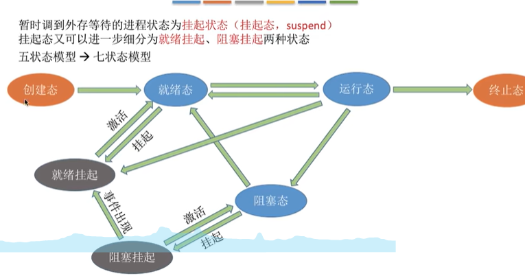
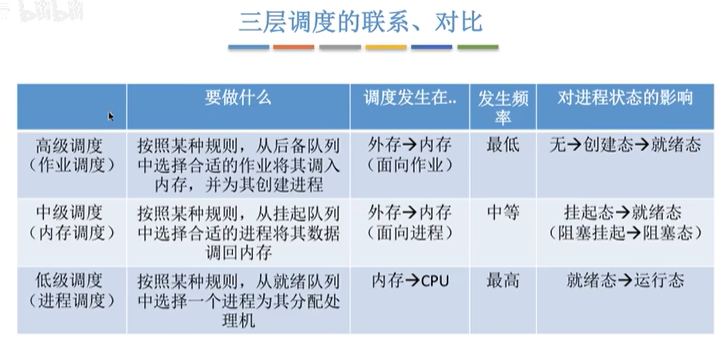
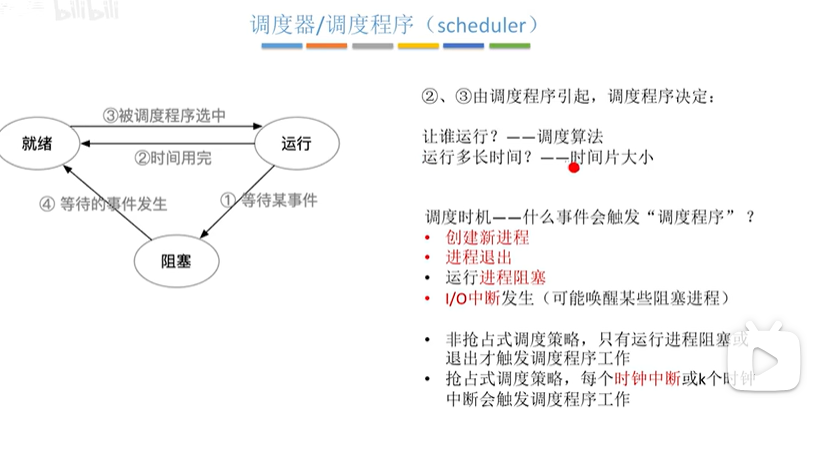
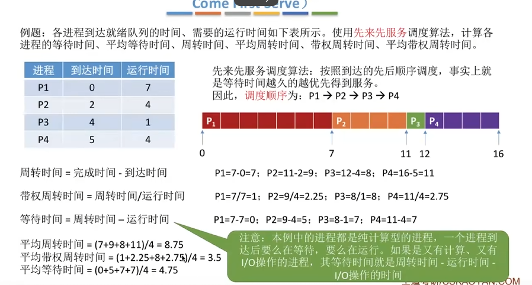

## 2.2_1_处理机调度的概念和层次

* gxy总结：
  需要掌握调度的概念。
  理解三种各自的应用场景。
  在理解应用场景的基础之上，结合背后的场景对各自的次数进行比较。

调度的`概念`： 当有多个任务需要进行处理的时候，由于资源有限，所以有一些任务不能同时处理，需要根据`某种规则`来决定处理任务的`顺序`。

处理机调度：从就绪队列中**按照一定的算法选择一个进程**并**将处理机分配给它**运行，以实现进程的并发执行。

* **高级调度_作业调度_**
  作业的概念：是一个具体的任务。

  进行调度的背景：启动一个程序，相关数据一定要从外存放到内存，但是内存有限，如果内存满了，不能直接放进去，会进行`高级调度`。
  **高级调度做的事情:**OS会按照一定的规则从作业后备队列中选择一个作业调入内存，并且创建进程。高级调度对每一个作业，开始的时候调入一次，结束的时候调出一次。

* **低级调度_处理机调度/进程调度_**
  处理机调度的背景：有时候要处理很多进程，但是cpu资源有限，所以需要调度，从进程就绪队列中选一个进程分配CPU。

  **低级调度做的事情：**按照某一种策略从`就绪队列`中取出一个进程，将处理机分配给它。
  处理机调度是一件会经常发生的事情，频率很高。

* **中级调度_内存调度_**
  产生的背景：在内存不够的时候，OS可以将某些进程的数据调出到外存。等到内存空闲或者进程需要运行的时候再重新调入内存。

  暂时调到外存等待的进程状态时`挂起状态`，被挂起的进程PCB会组织成`挂起队列`。

  **中级调度做的事情：**按照某种策略决定将哪个处于挂起状态的进程重新调入内存。
  一个进程可能会被多次调出调入内存，中级调度的次数可能比高级调度的次数多。

* 补充：挂起状态和七状态模型。
  如果内存不够用，可能把一个处于就绪态的进程`挂起`成为`就绪挂起`的状态，阻塞状态的进程也可以被挂起成为`阻塞挂起`的状态。

  
  
  解释：
  阻塞，就是当前没有得到某一种资源，然后继续在这里等，其他资源还在内存里面。
  挂起，我的进程映像直接被调到了外存。

* 三种调度的对比：
  

## 2.2_2_进程调度的时机、切换与过程、调度方式

* gxy总结：
  官方说这一节不是很重要。但时我觉得临界区和广义、狭义上的进程调度都是可以帮助理解的知识点。
  其实一句话总结，就是如果进程访问了`内核程序临界区`，就会导致不能进行进程调度，因为进程调度要访问进程的就绪队列，而当前进程访问了`内核程序临界区`，就把这里上锁了。

* 进程调度的时机，什么时候需要进程调度？

  * 当前运行的进程主动放弃处理机：
    进程的正常终止
    进程运行中发生异常而终止
    进程主动阻塞（比如等待打印机）
  * 当前运行的进程**被动放弃处理机**:
    进程分到的时间片用完、有更紧急的比如中断的事情需要处理、有更高优先级的进程进入就绪队列。

* 不能进行进程调度的情况：
  1.处理中断的时候。因为中断比较复杂。
  2.进程在`os内核程序临界区`中。
  3.原子操作中，原语中。

* 理解：**进程在OS内核程序临界区中不能进行调度和转换**。
  **进程在临界区时可以进行处理机调度**。

  前置知识：
  `临界资源`: 只允许同一时刻一个进程访问的资源，各个进程需要`互斥`地访问临界资源。
  `临界区`：访问临界资源的代码。
  因此各个进程也只能互斥的进入临界区。
  什么是`内核程序临界区？` 一般用来访问某种`内核数据结构`，比如进程的就绪队列。

  当一个进程处于 内核程序临界区，并且需要访问进程的就绪队列的话，在访问之前会把就绪队列锁上，如果这个进程不退出这个内核程序临界区，这个就绪队列不允许其他进程访问。就绪队列很明显和`进程调度`有关系，所以这个时候会导致不能进行进程调度。 从另外一个方面来看：如果一个进程访问了`内核程序临界区`，特别是进程就绪队列，那么应该尽快完成自己的工作并释放，不让会影响正常计算机工作。

  如果进程访问的是普通的临界资源：比如打印机。
  访问的时候，会先上锁，在进程结束之前，打印机一直上锁，但是打印机比较慢，这个时候CPU会空闲。所以这个时候应该进行`进程调度`。
  其实最关键的是，访问的普通临界区和进程调度没有关系，所以也不会影响进程调度。

* 进程剥夺的方式：
  
  
  非剥夺：简单、开销小但是不能处理紧急任务，适合早期批处理系统。
  剥夺：可以优先处理紧急的进程，也可以实现时间片轮转。适合分时OS。

* 进程的切换与过程。
  狭义的进程调度，只是指选择一个进程要开始运行，要分配处理机器。
  广义的进程调度，包含之前的一个进程让出来处理机，之后的进程占用处理机。

  广义的进程调度包括`选择一个进程`和`进程切换`两个步骤。
  进程切换的时候做了什么：

  * 1.对原来的运行进程中 的数据进行保存。
  * 2.对新的进程的数据进行恢复。
    上面所说的数据 是一些运行信息，比如PC,PSW,各种数据寄存器等等。

* 进程的切换不是越多越好:
  首先，进程的切换有代价，如果非常频繁的一直切换进程，会使得OS大量时间都用在切换进程上，真正用于执行进程的时间减少。

## 2.2_3_调度器和闲逛进程

gxy总结：感觉就是把之前的有一些点又说了一遍。

* 不支持内核级线程的OS，调度程序的处理对象是进程。
  支持内核级线程的OS，调度程序的处理对象是线程。
* 闲逛进程：
  CPU如果没有就绪进程，会选择让闲逛进程上CPU。优先级最低，能耗最低。啥也不干。0地址指令，不访问寄存器，同时也会指令周期末尾检查中断。

## 2.2_4_调度算法的评价指标

* gxy总结：cpu利用率，系统吞吐量，周转时间，带权周转时间，等待时间，响应时间。
  各自掌握定义即可。

  有一个题目[链接](https://blog.csdn.net/qq_45432665/article/details/105141907)

* CPU利用率：
  CPU忙碌的时间占总时间的比率。$利用率 =\frac{忙碌的时间}{总时间}$

* 系统吞吐量：单位时间内完成作业的数量。
  $系统吞吐量 = \frac{总共完成多少道作业}{总共花的时间}$

* 周转时间：
  `定义`：周转时间是指从作业被提交给系统开始，到作业完成为止的时间间隔。
  
  平均周转时间 = 所有作业周转时间和 / 作业数目

* 带权周转时间：
  ==是一个比率吗？？？？？之后细说==

  说明：带权周转时间一定$\ge$ 1 ,分子是大的，而且我们希望带权周转时间越小越好，和
  $$
  带权周转时间 = \frac {作业周转时间}{作业实际运行时间} = \frac{作业完成时间-提交时间}{作业实际运行时间}
  $$

$$
平均带权周转时间 = \frac{各个作业带权周转时间之和}{作业个数}
$$

* 等待时间：
  `定义：`指进程处于等待处理机状态之和，等待时间越长，用户的满意度越低。
  
  **注意对于进程和作业的等待时间不一样。**
* 响应时间：**用户从提交命令到首次响应所使用的时间**。

## 2.2_5_调度算法：

* FCFS：
  `算法规则：`按照作业/进程到达的先后顺序进行服务。
  `处理作业/进程`：作业调度中，考虑的是哪个作业先到达后备队列。进程调度考虑的是哪一个作业先到达就绪队列。
  `非抢占式算法`。
  `优缺点：`
  优点：公平，实现简单。
  缺点：排在长作业后面的短作业需要等待很长时间，导致带权周转时间大。
  `对长作业有利，对短作业不友好`。

  **是否会导致饥饿：**
  饥饿 就是一个进程/作业长时间得不到服务。
  不会导致饥饿。

  * FCFS例子：
    

* SJF/SPF：short job first short process first:
  `思想：`追求最少的平均等待时间，最少的平均周转时间，最少的平均带权周转时间。
  `规则：`最短的作业/服务优先得到服务。
  `用于作业/进程调度：`用于进程时，一般称为短进程优先，short process first.
  `抢占否：`一般默认非抢占式，但是也有抢占式版本：`最短剩余时间优先算法`。

  一句话总结：
  非抢占式短作业优先，就是每一次运行的时候，都处理当前已经到达的运行时间最短的进程。
  抢占式的短作业优先，当有进程加入就绪队列的时候就需要调度，如果新到达的比之前的时间小。就改变运行的进程，

$$
 2^{2^n -n - 1}
$$

