## 2.3_1 进程同步、进程互斥

* gxy总结：
  引入了进程 异步性、互斥 的背景。
  需要理解 异步性、互斥的概念。前者是直接制约关系，后者是间接。
  理解 进程互斥 代码的四个部分 各个的主要作用、功能，能够区分开。需要能大体复述。
  最后，进程互斥 设计的原则，有个印象，理解即可。不需要能说出来。

* 进程具有`异步性`。
  `异步性`官方解释：各并发执行的进程以各自独立的、不可预知的速度往前推进。
  

  异步性，简单来说就是OS在运行两个进程的时候，各自目前的进度、速度都是随机的。可能先结束1，也可能先结束2.但是有一些情况下，可能会要求，进程2中的某一步应该在进程一的第一步完成之后再去完成会更好。（这里的意思不是说必须在他之后完成，而是如果在他之后完成会更好）。为了实现这样的目睹，我们引入`进程同步`机制。
  再举一个例子：
  

* **进程同步** 就是为了解决 **进程异步问题**产生的。
  
  ==进程同步就是让各并发执行的进程按照要求有序地推进。==
  **进程同步**的`概念：`同步是一种制约关系。进程同步是指两个或多个进程，为了完成一个任务，需要在某些位置上`协调`他们的`工作次序`而产生的制约关系。
  
* 什么是进程互斥。
  进程经常需要分配一些资源，有一些是`临界资源`，在一个时间段内只允许一个进程使用的资源。
  让不同进程不会同时访问临界资源，就需要进程互斥。

* **进程互斥的概念：**
  `进程互斥`是指当一个进程访问某一个临界资源的时候，另外一个想要访问这个临界资源的进程必须等待。等到当前访问临界资源的进程访问结束之后，另外一个进程才可以去访问他的资源。

* 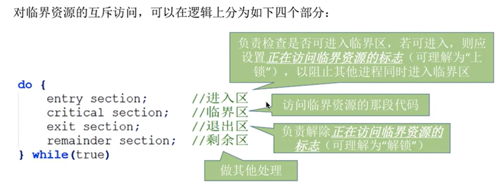

* 进程互斥的原则：
  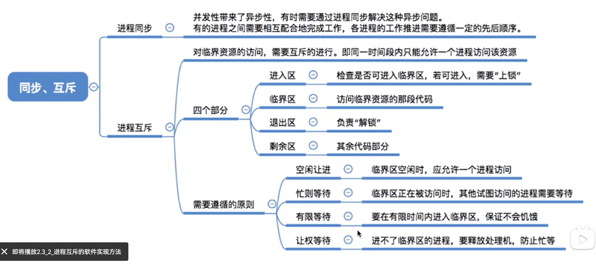

## 2.3_2_进程互斥的软件实现方法

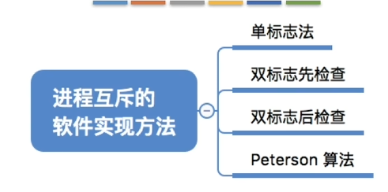

学习要求：理解每一个算法的思想，结合上面的互斥代码的四个逻辑部分，终点理解进入区、退出区都干了啥。分析算法缺陷。空闲让进 忙则等待 有限等待 三个主要的要求。

* gxy总结：
  每一种方式 能够大概明白代码如何写，其实就是最后的思想。然后明白各自优缺点，

* 单标志方法：
  `算法思想：`两个进程在`访问完临界区之后`会将访问权限转交给另外一个进程。
  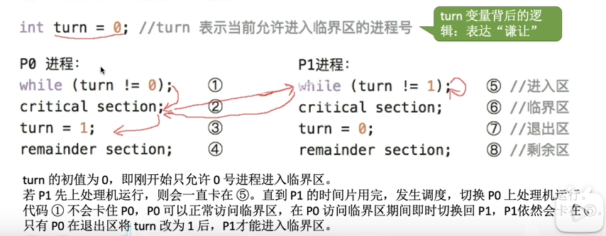

  说明一些可能出现的场景：
  首先 turn == 0 ,如果最开始 p1进程在处理机上面运行，会一直运行5语句，然后时间片用完，给进程p0，正常运行。如果p0运行语句2的时候，时间片用完，p1上处理机之后还是会继续卡在语句5。只有p0的23语句运行完了之后，p1才能正常运行语句6.

  **缺陷：**
  
  违背了`空闲让进`原则，也就是说，每一个人一次，是一种绝对的公平，但是如果一个进程一直不需要访问临界区，另外一个进程就需要一直等待。

* 双标志先检查方法：
  `思想：`使用数组来表示一个进程`是否想要进入临界区`。flag[i] = true表示进程i有进入临界区的意愿。
  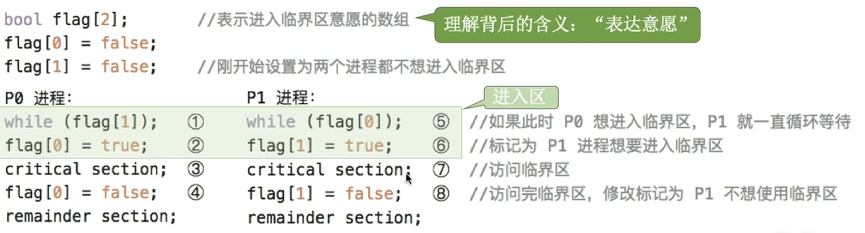
  每一个进程，先看对方有没有意愿，如果对方没有，把自己的意愿设置为1，然后自己运行，运行结束之后，意愿设置为0.

  **缺点：**
  把1，5语句理解为检查，2 6 语句理解为上锁。
  检查 和上锁 两个处理不是一气呵成的，在两个进程并发执行的时候，有可能会出现在检查完成之后进程转换。最后导致两个进程都可以进入临界区。
  **违背了**，`忙则等待`原则。

* 双标志 后检查方法：
   双标志先检查法是先进行检查，之后上锁，后检查法是先上锁，之后进行检查。
  每一个进程代码的思想：先进行上锁，之后检查对方是否有意愿，如果有，一直等待，当对方没有意愿之后，自己运行。
  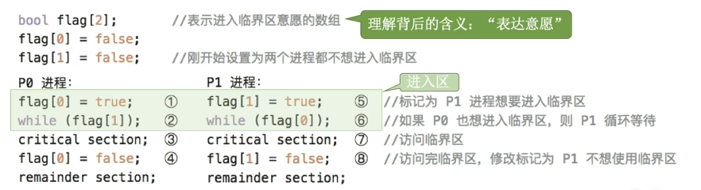
  缺点：
  如果并发执行，因为异步性，可能出现执行 1 5 之后执行 2 6 的时候都不能往下推进。

  解决了`忙则等待`违背了`空闲让进`和`有限等待`。（因为会一直等待，所以会产生饥饿现象）。

* Peterson算法：
  `思想`：结合双标志方法、单标志法的思想。如果双方都争着进入，就会尝试各自谦让一波。

  代码：
  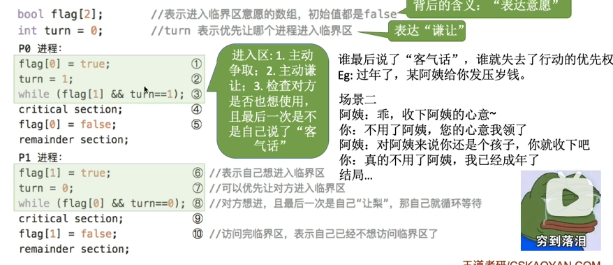
  可以发现，上面的过程，就算两个进程并发执行，无论是什么顺序，都不会出现不好的情况。

  可以理解为 类似谦让的过程，最后一句谦让的话语，也就是turn = 另外一个进程号 的语句。谁进行了最后的谦让，谁就要等待对方的 意愿结束之后才能运行。

  优缺点：
  
  让权等待的意思： 如果当前进程不能访问临界区或者没有这个需求，就让出来这个权限。

* 总结：
  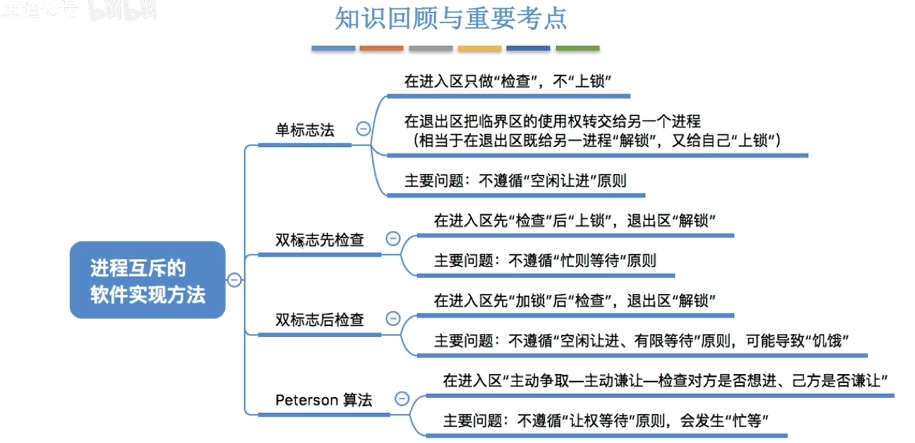


## 2.3_2_进程互斥的硬件实现方法


* gxy总结：
  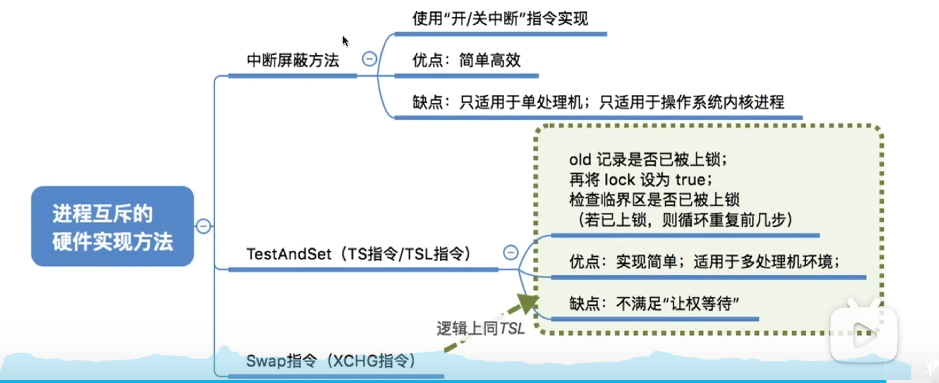
  理解三种方法各自的优缺点。理解tsl swap和之前的软件方法实现进程互斥的互通性。
  理解各自优缺点。
  个人觉得没必要会写这部分代码。

* 中断屏蔽方法
  `思想`：利用开/关中断指令来实现。和原语操作的思想类似，关了中断之后不能切换进程，也就不会出现对于临界资源两个进程一起访问的情况。

  

  优点：逻辑清晰、实现简单。
  缺点：不适用于多处理机，因为多处理机可能会出现两个处理及上面各自的进程来访问临界资源；只适用于OS内核进程，因为开/关中断指令，只能运行在内核态。

* TestAndSet： TS /TSL
  `思想：`用硬件来帮忙实现，在执行的过程中不会被中断。
  其实思路和之前的 双标志先检查法 很类似，在双标志先检查方法中可能会出现的问题主要在 检查和上锁这两步中间如果出现了进程切换，就会导致之后两个进程都可以访问临界资源。TSL指令就是从硬件层面来保证这个过程是一气呵成的。

  C语言书写逻辑：
  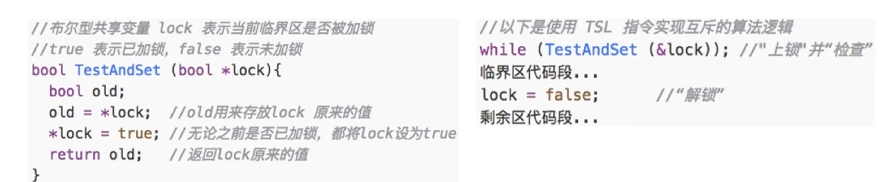
  说明：lock 是一个变量，为1的时候说明已经上锁了。这个代码最后实现的效果是如果Lock一开始为1，那么就会一直运行while语句，只有lock变为0之后，才会进入临界区.

  有一个巧妙的点在于 无论lock本身为0，1通过testandlock函数之后，Lock都被重新赋值为1，保证了如果 当前进程之后可以访问临界区的情况下不会有其他的进程进入。

  `优缺点：`相比软件中的实现方法，就是把"检查"和"上锁"两个过程实现了一气呵成。
  实现简单，不需要像软件实现方法那样严格检查是否会有逻辑漏洞出现，适用于多处理机环境。
  `缺点：`不满足让权等待，如果一个进程在运行的时候没有访问临界资源的权限，就会一直执行while语句，会出现"忙等"现象。

* SWAP：
  `思想：用硬件来帮忙实现，在执行的过程中不会被中断。`
  和testandsetlock指令的思想基本一致，只不过在实现方法上面有区别而已。
  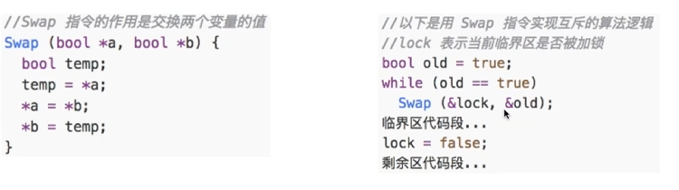

  效果：当lock本身为true,会一直运行while语句；如果Lock本身为false，就会变为true，但是当前进程就可以访问临界区了。

  `优缺点：`相比软件中的实现方法，就是把"检查"和"上锁"两个过程实现了一气呵成。
  实现简单，不需要像软件实现方法那样严格检查是否会有逻辑漏洞出现，适用于多处理机环境。
  `缺点：`不满足让权等待，如果一个进程在运行的时候没有访问临界资源的权限，就会一直执行while语句，会出现"忙等"现象。

## 2.3_4_互斥锁

用于实现进程互斥。

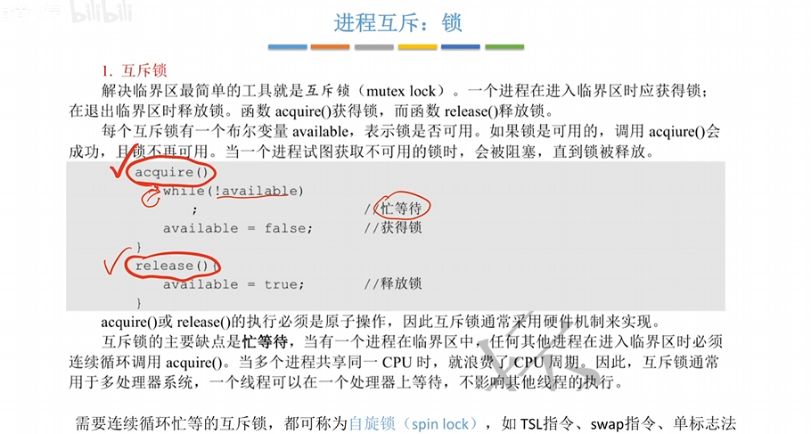

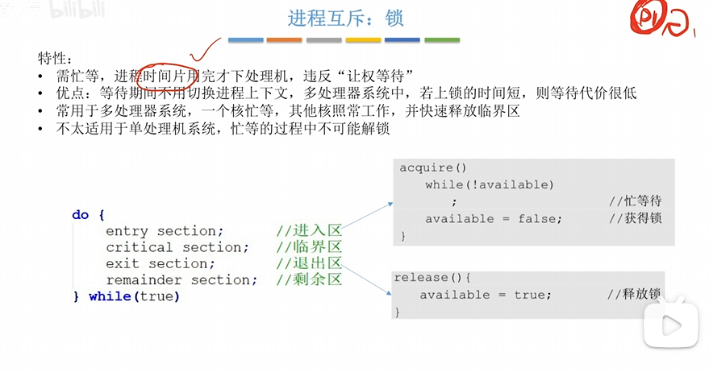

* 互斥锁适合用于多处理机系统，不适合单处理机，因为单处理机中一定会出现忙等现象。
  在多处理机中，虽然也会出现等待现象，但是正在访问临界资源的进程在其他核心上面会很快运行完成，这个花销并不是很大。

## 2.3_5_信号量机制

* gxy；
  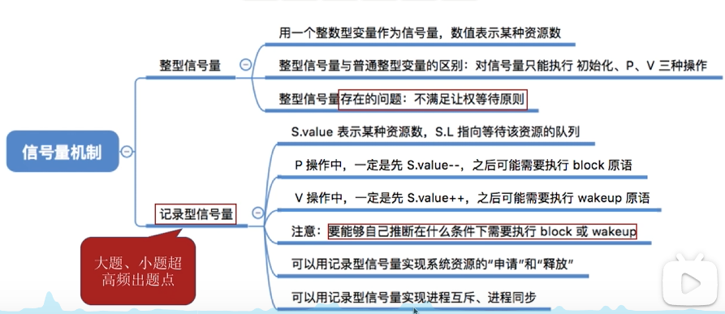
  **整型信号量**不满足让权等待原则。如果分不到临界资源的访问权，就会一直等待。
  记录型信号量的PV操作的函数，需要会写。
  理解什么时候会block wakeup 各自做了什么事情，以及为什么。
  
  **实际意义：**
  如果信号量小于0，说明现在有进程正在等待这个资源。
  P操作，就是申请一个资源，如果没有等待到就进入阻塞队列。
  S操作，就是释放一个资源，如果此时有进程刚好在等待，就唤醒一个进程。


引入信号量机制 其实还是为了帮忙实现 进程互斥。

* 用户进程可以通过OS提供的`一对原语`来对`信号量`进行操作，可以方便的实现进程互斥、进程同步。

  信号量种类：**可以是一个整数，也可以是更复杂的记录型变量。**

  **一对原语:**wait(S) 和 signal(S) 原语，信号量S就是函数调用的时候的一个参数。wait signal 简称为P\V操作。

  

* 信号量机制----整型信号量。
  `用一个整数型的变量作为信号量，`用来表示系统中某种资源的数量。
  对信号量的操作只有三种：初始化、P操作、V操作。
  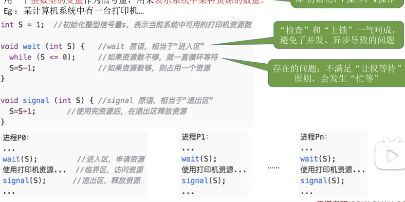
  上面的例子就描述了这样的操作：打印机只要1个，进程需要使用打印机的时候，会先进行P(s)操作，结束之后就可以使用打印机，使用完成之后，使用V(S)操作来释放信号量。
  **会出现忙等。**
  有一个问题，因为wait 和 signal都是原语，应该是不能被终端的，如果wait里面的while一直运行，岂不是会永远一直这样运行？
  

  ==**问题：整型信号量不满足让权等待原则，会发生忙等。**==（这个问题比较重要）

  * 记录型信号量：
    引入：为了解决上文出现的忙等问题，提出了记录型信号量。
    定义：
    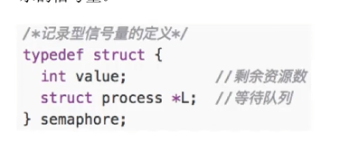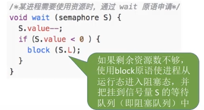
    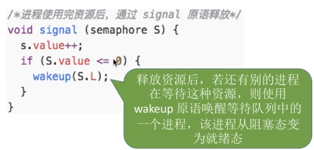
    在wait操作中，如果剩余资源数目不够，就会使用block原语使得进程从运行态转变为阻塞态，放到阻塞队列里面。
    signal操作中：如果还有别的进程在等待，就唤醒等待队列中的一个进程，让他从阻塞态变为就绪态。

    S.value的初始值就设置为某种资源的数目。

    **对记录型变量的总结：**
    
    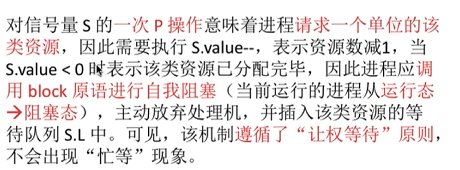
    


换个角度 来想  目前来看目前来看 最不好的情况 就是这个华师成功到底 比东华好一些 不要一直去想 到底什么才是最优解。

2.3_6_用信号量机制实现进程同步、互斥
---

之前的硬件、软件实现进程互斥的方法中，都没有办法实现让权等待。信号量机制里面的阻塞和唤醒可以帮忙实现让权等待。

* gxy：
  借助信号量机制实现进程互斥：在临界区之前P，在临界区之后V。
  实现进程同步：S=0. 前V后P。

  会写代码，其实只要理解之后难度不大。
  
* 如何用信号量机制来实现进程互斥？（这里提供一份代码的模板）
  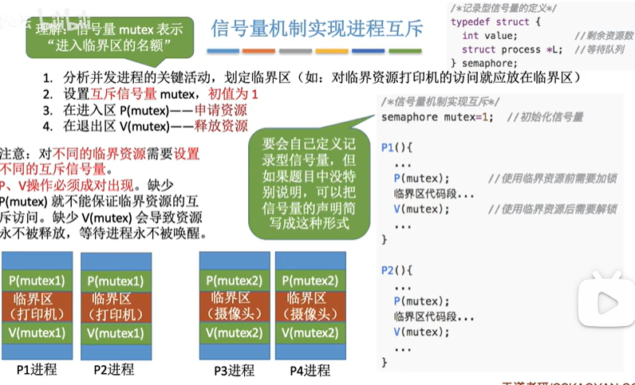
  1.划定临界区。
  2.设置`互斥信号量`，初始值为1.
  3.定义P\V操作，在进入临界区之前申请资源，推出临界区的时候释放资源。

  ```c++
  semaphore mutex = 1;
  P1(){
      ...
      P(mutex);//申请资源
      临界区代码;
      V(mutex); //释放资源
  }
  P2(){
      ...
      P(mutex);//申请资源
      临界区代码;
      V(mutex); //释放资源
  }
  ```

* 如何用信号量机制实现进程同步：

  * 先说明一个进程同步的例子。（进程同步就是让各并发执行的进程按照我们想要的顺序稳步推进）
    比如: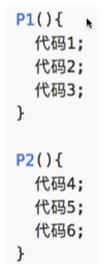
    如果我们想要进程2的代码4，一定是进程1的代码1、代码2执行完毕之后再执行，这就是一个进程同步问题。
    也就是解决进程原先并发执行的异步性。

  * 如何实现进程同步：
    ==**前V后P**==

    1.明白`一前一后`的关系是哪些代码，上面的例子中P1的12是前，P2的代码4是后。
    2.设置`互斥信号量`S，初始值为0.
    **3.在前操作之后释放信号量，V(S).**
    **4.在后操作之前申请信号量，P(S).**
    完整代码:
    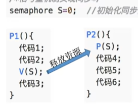

    * 对上面的代码进行一波可能发生的情况的说明(并不需要记住，只是单纯想要记录)。
      如果说真实情况就是我们想要的，P1进程执行完了代码12之后，P2进程在运行的时候，P(S)操作，S--，成功推出，之后正常执行代码4.

      如果实际情况不是我们想要的，代码4先执行，因为P(S)操作，因为S=0，所以P2进程会执行`block原语`，主动请求阻塞。代码2执行完毕之后，执行V(s)操作，S++.S=0。由于有进程在这个信号量对应的阻塞队列，所以在V操作中会执行wakeup原语，唤醒P2进程，P2之后正常执行代码4.

* 借助信号量机制实现前去关系：
  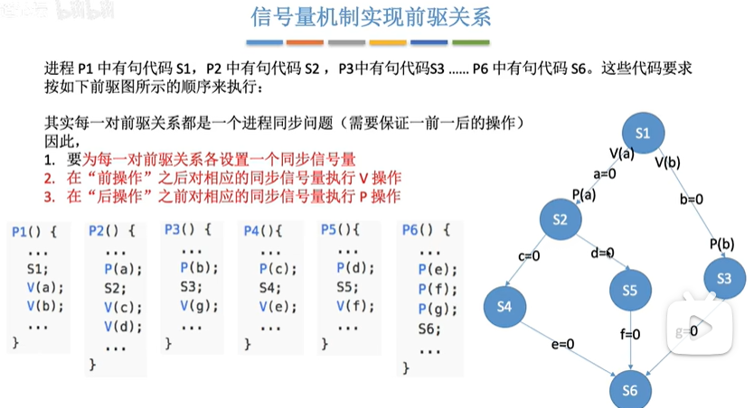
  前驱图的意思是说，只有前面的完成之后后面的才能执行。和进程同步的要求是类似的。

  对于每一个边，都代表一种进程同步关系，建立一个信号量(比如a)，前面的进程在完成之后进行V(a),后面的进程在执行之前进行P(a)。通过前V后P，就可以实现必须前面的进程执行完毕之后，后面的进程才能执行。

2.3_7_
---

几个经典的问题 和 管程 这里先不研究了。
因为感觉这一部分比较应试，应该在考试之前学习。
