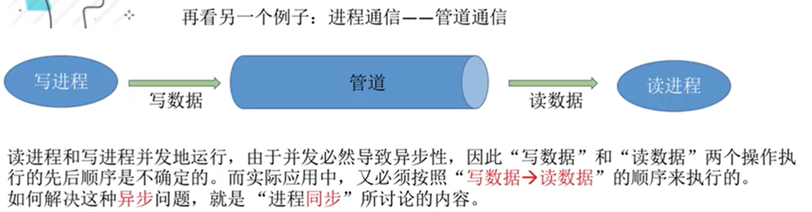

## 2.3_1 进程同步、进程互斥

* gxy总结：
  引入了进程 异步性、互斥 的背景。
  需要理解 异步性、互斥的概念。前者是直接制约关系，后者是间接。
  理解 进程互斥 代码的四个部分 各个的主要作用、功能，能够区分开。需要能大体复述。
  最后，进程互斥 设计的原则，有个印象，理解即可。不需要能说出来。

* 进程具有`异步性`。
  `异步性`官方解释：各并发执行的进程以各自独立的、不可预知的速度往前推进。
  

  异步性，简单来说就是OS在运行两个进程的时候，各自目前的进度、速度都是随机的。可能先结束1，也可能先结束2.但是有一些情况下，可能会要求，进程2中的某一步应该在进程一的第一步完成之后再去完成会更好。（这里的意思不是说必须在他之后完成，而是如果在他之后完成会更好）。为了实现这样的目睹，我们引入`进程同步`机制。
  再举一个例子：
  

* **进程同步** 就是为了解决 **进程异步问题**产生的。
  **进程同步**的`概念：`同步是一种制约关系。进程同步是指两个或多个进程，为了完成一个任务，需要在某些位置上`协调`他们的`工作次序`而产生的制约关系。

* 什么是进程互斥。
  进程经常需要分配一些资源，有一些是`临界资源`，在一个时间段内只允许一个进程使用的资源。
  让不同进程不会同时访问临界资源，就需要进程互斥。

* **进程互斥的概念：**
  `进程互斥`是指当一个进程访问某一个临界资源的时候，另外一个想要访问这个临界资源的进程必须等待。等到当前访问临界资源的进程访问结束之后，另外一个进程才可以去访问他的资源。

* 

* 进程互斥的原则：
  

## 2.3_2_进程互斥的软件实现方法

学习要求：理解每一个算法的思想，结合上面的互斥代码的四个逻辑部分，终点理解进入区、退出区都干了啥。分析算法缺陷。

* 单标志方法：
  `算法思想：`两个进程在`访问完临界区之后`会将访问权限转交给另外一个进程。
  

  说明一些可能出现的场景：
  首先 turn == 0 ,如果最开始 p1进程在处理机上面运行，会一直运行5语句，然后时间片用完，给进程p0，正常运行。如果p0运行语句2的时候，时间片用完，p1上处理机之后还是会继续卡在语句5。只有p0的23语句运行完了之后，p1才能正常运行语句6.

  **缺陷：**
  
  违背了`空闲让进`原则，也就是说，每一个人一次，是一种绝对的公平，但是如果一个进程一直不需要访问临界区，另外一个进程就需要一直等待。

* 双标志先检查方法：
  `思想：`使用数组来表示一个进程`是否想要进入临界区`。flag[i] = true表示进程i有进入临界区的意愿。
  
  每一个进程，先看对方有没有意愿，如果对方没有，把自己的意愿设置为1，然后自己运行，运行结束之后，意愿设置为0.

  **缺点：**
  把1，5语句理解为检查，2 6 语句理解为上锁。
  检查 和上锁 两个处理不是一气呵成的，在两个进程并发执行的时候，有可能会出现在检查完成之后进程转换。最后导致两个进程都可以进入临界区。
  **违背了**，`忙则等待`原则。

* 双标志 后检查方法：
   双标志先检查法是先进行检查，之后上锁，后检查法是先上锁，之后进行检查。
  每一个进程代码的思想：先进行上锁，之后检查对方是否有意愿，如果有，一直等待，当对方没有意愿之后，自己运行。
  
  缺点：
  如果并发执行，因为异步性，可能出现执行 1 5 之后执行 2 6 的时候都不能往下推进。

  解决了`忙则等待`违背了`空闲让进`和`有限等待`。（因为会一直等待，所以会产生饥饿现象）。

* Peterson算法：
  `思想`：结合双标志方法、单标志法的思想。如果双方都争着进入，就会尝试各自谦让一波。

  代码：
  
  可以发现，上面的过程，就算两个进程并发执行，无论是什么顺序，都不会出现不好的情况。

  可以理解为 类似谦让的过程，最后一句谦让的话语，也就是turn = 另外一个进程号 的语句。谁进行了最后的谦让，谁就要等待对方的 意愿结束之后才能运行。

  优缺点：
  
  让权等待的意思： 如果当前进程不能访问临界区或者没有这个需求，就让出来这个权限。

* 总结：
  

