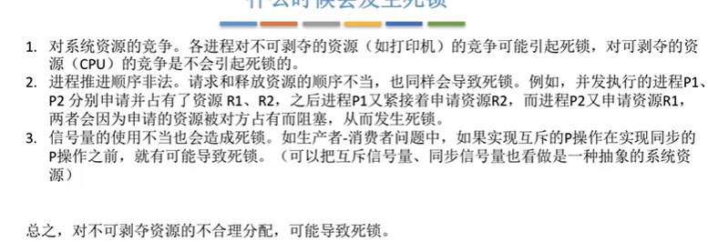

2.4_1_死锁的概念
---

* gxy：
  掌握死锁概念。
  理解、区分死锁、饥饿、死循环。
  掌握死锁发生的必要条件：争夺互斥资源、进程不可剥夺、申请且保持、循环等待链。

* 死锁的概念：
  各个进程因为争夺资源而造成的一种`互相等待对方手里的资源`，导致各进程都阻塞，无法向前推进的现象。

  发生死锁之后，如果没有外力的干涉，这些进程都将无法向前推进。

* 死锁、饥饿、死循环区别：
  
  饥饿：长期得不到自己想要的资源，导致一直不能往前推进的状态。
  比如之前的short process first中，长进程很有可能会一直没有办法得到处理机资源，就会一直等待，就是饥饿。

  饥饿往往是 阻塞态或者就绪态
  而死循环可以是运行态，只不过是不会往下推进，其实一直在执行。

  死循环：往往是逻辑错误，或者是程序员故意如此设计。

* 死锁产生的必要条件：
  1.**互斥条件。**必须是进程对于互斥资源的争抢。
  2.**不剥夺条件。**进程获得的资源只能主动释放，不能被其他进程强行夺走。
  3.**请求和保持条件**。每一个进程至少保持一个资源，至少申请一个新的资源，又对自己已经有的资源保持不放。
  4.**循环等待条件。**一定有循环等待链。循环等待链是死锁的必要不充分条件。

* 什么时候会发生死锁：
  下面会提供一个例子。
  一句话总结就是`对不可剥夺资源的不合理分配就可能会导致死锁。`
  

* 死锁处理策略：
  

死锁处理的大纲：
---

预防和避免都是从不允许死锁发生的角度。
死锁的检测和解除是允许死锁的发生的角度。

2.4_2_死锁处理策略--预防死锁
---

预防死锁的思路，就是看能不能破坏死锁产生的四个必要条件，只要破坏了至少一个，死锁就不会发生。

* gxy:
  这一节课的所有内容，理解即可，不需要会背。
  

* 破坏互斥条件：只有对互斥资源进行争夺才会产生死锁。

  比如在多个进程同时争夺打印机的使用权时，可以采用SPOOLing技术，可以把打印机这个独占设备改为共享设备。
  具体实现的细节时SPOOLing技术里面的输出进程接受了多个进程的打印机请求之后，自己内部进行处理并在最后输出。然后从进程的角度看，打印机的资源变为了共享设备，但只是从进程的角度看。

  这个方法的缺点：不是所有的互斥资源都可以更改为共享资源，而且出于系统安全的考虑，很多互斥条件时必须保持的，不能被破坏。

* 破坏不剥夺条件：进程中获得的资源在使用完毕之前，不能被其他进程强行夺走，只能自己主动释放。
  

* 破坏请求和保持条件：进程已经至少保持了一个资源，但是又提出了新的资源的请求，但是新的资源被其他进程等占用，所以自己进入阻塞状态，同时**保持自己原来的资源**不变。

  可以采用`静态分配方法`：进程在运行前一次申请完所有它需要的全部资源，只有得到全部资源之后才会进入运行，并且一旦运行之后，这些资源就一直属于这个进程。

  缺点：如果一个资源利用时间很短，进程运行时间长，这个资源就会一直闲置，导致这个资源的利用率低。有可能产生饥饿：有一种进程1需要资源1，进程2需要资源2，进程3需要1\2两个资源，在有很多进程1的情况下，进程3就一直不能得到自己需要的所有的资源，就会饥饿。

* 破坏循环等待链条件：
  

## 2.4_3_死锁处理策略避免死锁

* gxy总结：
  理解什么是安全序列，掌握不安全状态和死锁的关系
  掌握银行家算法流程。
  需要掌握 need 是需求矩阵 max 是最大需求矩阵 allocation是已经分配的资源矩阵

* `安全序列：`就是指如果系统按照这种序列分配资源，每一个进程都可以顺利完成。只要能找到一个安全序列，就是处于`安全状态`。
  如果系统分配资源之后，找不到一种安全序列，系统就进入了`不安全状态`，意味着之后有可能进程没有办法顺利执行下去。但是也有可能会顺利执行。（但是分配资源的时候要考虑最坏的情况）
  所以：
  **不安全状态不一定会发生死锁**，**但是死锁一定是处于不安全状态**。
  **安全状态一定不会发生死锁。**

* 银行家算法：
  `思路：`在资源分配之前预先判断这次分配是否会导致系统进入不安全状态，以此来决定是否要分配请求。如果会进入不安全状态，就不进行这一次资源的分配，就应该让这个进程首先阻塞等待。

  存储的数据结构：
  
  

* 银行家算法步骤:
  1.计算这一次的资源分配是不是超过了这个进程的最大需求。
  2.检查资源是不是可以满足这一次的分配。
  3.试探分配，之后更改数据结构。
  4.用安全性算法检查这一次分配之后会不会进入不安全状态。

* 安全性算法检查：
  假设当前是a,b,c 找一下所有进程的need矩阵，如果a b c可以满足要求，就可以完成这个进程，就可以让当前资源 加上 这个进程的所有资源，其实就是加上allocation，已经分配的资源。然后再从第一个进程开始判断，最后看能不能找到一种顺序把所有的进程都处理完毕。

## 2.4_4_死锁的处理策略，检测和解除

* gxy 总结：
  死锁的检测 比较重要，资源分配图需要东。
  死锁检测算法：依次消除与不阻塞进程想连的边，直到无边可消。
  死锁定理：如果资源分配图是不可以简化的，就说明发生了死锁。

  解除死锁的方法：资源剥夺法，撤销进程法，进程回退法。
