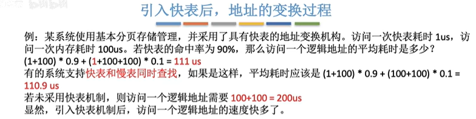

3.1_1_内存的基础知识
---

这一部分，比较杂，比较碎，但是其实比较重要。之后再学习吧。
里面甚至讲解了有关 写程序到程序运行的过程中做了什么。

3.1_2_内存管理的概念
---

* gxy总结：
  **这一节不是很重要，知识对于内存要做什么形成一个框架。**
  

  这一节就围绕着 内存管理做了什么。
  内存空间的分配和回收
  从逻辑上对内存空间进行扩充。
  物理地址和逻辑地址的转换。==这一点之后学完3.1_1再把这里回顾一下==
  如何进行内存保护，让每一个进程只能访问自己的内存区域的数据。

OS作为系统资源的管理者，对于内存的管理要做些什么？
进程运行之前，进程相关数据要放到内存里面。内存中有的区域是空闲的，有的不是空闲的，操作系统要如何管理这些空闲、非空闲的区域？
以及一个数据要放到内存，但是有很多空闲的区域都可以放，到地方哪里？
进程运行结束之后，如何把进程占用的内存空间回收？

* 内存管理做什么：
  1.OS负责**内存空间的分配和回收**。
  2.OS提供某种技术从逻辑上**对内存空间进行扩充**。（比如说，一个游戏大小为60G，但是内存只有4G，运行的时候需要采用虚拟技术，可以把物理上很小的内存转换为逻辑上很大的内存）。
  3.OS应该提供**地址转换**的功能，负责程序的`逻辑地址`和`物理地址`的相互转换。
  
  4.内存保护：使得各个进程只能访问自己的内存区域，不能访问别的进程的。

  内存保护的方法：
  <1>。可以设置上下限寄存器，存储这个进程的内存空间占据的地址的起点和终点，访问指令的时候，首先检查是否越界。
  <2>。采用`重定位寄存器加界地址寄存器`进行越界检查。举一个例子，一个进程的内存地址是100~279，重定位寄存器放100，**界地址寄存器**放最大逻辑地址就是179。每一次要访问一个地址的时候，比如逻辑地址80，先和界地址寄存器进行比较，如果大于界地址寄存器的值，就是越界。**重定位寄存器又称为基址寄存器，界地址寄存器又称为限长寄存器。**
  

3.1_3_覆盖与交换
---

* gxy总结：
  这一节主要讲的是上面的 OS中内存管理做的事情中的内存的扩充。
  内存的扩充有三种方法：
  这里讲了覆盖技术和交换技术。

  只需要理解覆盖技术和交换技术的思想即可。
  
  * 覆盖技术的思想：
    首先把一个程序分为多个段，常用的段常驻内存，不常用的段在需要的时候调入内存，使用完成调出内存。
    在程序分段之后，形成一种调用结构，在此结构里面，同一深度的不会同时被调用，程序段指挥被自己的父亲段调用，所以存储的时候，只存储每一个深度最大的程序段的空间即可。
  * 对换技术：
    内存空间紧张的时候，系统将内存中一些进程暂时`换出`到外存，把外存当中已经具备运行条件的进程`换入`内存。
  
  固定区域的程序 不会调入调出。覆盖区的程序段在运行中会根据需要进行调入调出。
  
* 覆盖技术：
  `思想：`将程序分为多个段(多个模块)。常用的段常驻内存，不常用的段需要的时候调入内存。
  内存会分为一个`固定区`和若干个`覆盖区`。
  固定区在调入之后就不会调出，直到运行结束。
  覆盖区需要需要用到的时候调入内存，用不到的时候就会调出内存。

  举例：
   
  解释一下这个调用结构:
  A会调用BC模块，但是两个不会同时调用，然后B会调用D模块，C会调用EF模块，但是EF不会同时，最多只会一个被调用。

  就可以通过覆盖技术设计这样的内存：
  
  划分一个A的固定区域，然后BC放在同一个覆盖区域，DEF也放在一个覆盖区域。

  然后再运行的时候，如果BCDEF需要运行，会使用自己相应覆盖区内存位置的内存，用完之后就会调出内存。

  缺点：
  **必须由程序员声明覆盖结构**，OS完成自动覆盖。
  对用户不透明，增加了用户编程的负担，覆盖技术只用于早期的OS中，已经成为历史。

* 交换技术思想：对换技术
  **内存空间紧张的时候，系统将内存中一些进程暂时`换出`到外存，把外存当中已经具备运行条件的进程`换入`内存**。其实就是进程在磁盘和内存之间的动态调度。

  举例：中级调度、进程调度：在内存紧张的时候，可以选择内存中的进程进入挂起状态，(PCB还在内存里面，帮助之后恢复这个进程的状态)，内存空间充足的时候，再把挂起的进程换入内存。

  问题：
  

  回答：
  1.如果有对换功能的OS，磁盘会分为文件区域和对换区域。
  文件区域：用来存放文件，追求空间利用率，应该用离散分配方式。
  对换区域：应该只占一小部分，被换出的进程就放在对换区。对换区应该追求换入换出速度，因此通常对换区`采用连续分配方式`。之后，对换区的I/O速度比文件区更快，也就是输入/输出速度。

  
  2.什么时候交换：
  
  

3.1_4_连续分配管理方式
---

OS对内存的管理需要实现：逻辑地址和物理地址的转换，内存空间的扩充(覆盖技术 交换技术)，存储保护（设置上下限，使用重定位寄存架 + 界地址寄存器），内存空间的分配和回收。

会先介绍 连续分配管理方式，连续和非连续分配的区别在于：
**连续分配是指，为用户进程分配的必须是一个`连续的内存空间`**。
非连续内存分配：就是系统为用户分配的地址空间不一定是连续的，可以是离散的。

* 介绍一个在评估内存管理的性能的时候会提到的一个专业名词：
  **内部碎片**：分配给某进程的内存区域里面，有一些部分没有用上，就是“内部碎片”。
  **外部碎片：**

* 单一连续分配方式：(在单道程序环境下)
  会把内存分为：`系统区`（存放OS相关数据），`用户区`（存放用户进程相关数据）。
  单一连续分配方式：内存中只能有一道用户程序，用户程序占整个用户区的空间。
  优点：实现简单，没有外部碎片
  缺点：只能单用户、单任务的OS，有内部碎片。

* 固定分区分配：
  `思想：`将整个用户空间划分为`若干个固定大小的分区`，每一个分区中，最多装入一个作业。

  形成了最早的、最简单的可以运行多道程序的内存管理方式。

  

  * 分区大小相等：
    把用户空间，划分为若干个大小相等的分区。
    **缺点**：缺乏灵活性，程序小的时候，会产生很多内存碎片，程序大的时候又装不下。
    **优点：**可以应用于 一台计算机控制多个相同对象的场合。比如工厂中，一台计算机，控制100台炼丹炉，每一个炼丹炉的内存空间可以都划分为一样。

  * 分区大小不等：

    增加灵活性，可以满足不同大小的进程需求。一般都是根据常常运行的作业的大小情况来进行划分。

  操作系统如何实现在`固定分区分配方法`中的各个分区的分配与回收：
  建立一个数据结构--`分区说明表`。表里面包含每一个分区的起始地址、大小、当前状态。

  优点：实现简单，**没有外部碎片**。
  缺点：
  1.如果用户程序太大，所有分区都不满足，只能用覆盖技术，会降低性能。
  2.会产生**内存碎片**，内存利用率低。

* 动态分区分配：
  `思想：`可变分区分配，不会预先划分内存分区，而是在进程装入内存的时候，`根据进程的大小动态地建立分区`，使得分区的大小正好适合进程的需要。
  提出一些问题：

  * 用怎样的数据结构来记录内存的使用情况：
    使用空闲分区表、或者空闲分区链。
    每一项会记录空闲分区的开始地址、大小记录下来。而空闲分区表里面内容的排列顺序和使用那种动态分配算法有关系。

  * 有很多空闲分区的时候，选择哪个分区进行分配？
    下一节的动态分区分配算法回答这个问题。

  * 如何进行分区的分配和回收操作？

    分配是通过动态分区分配算法来选择的，分配完了之后要更改对应的空闲分区表/链，有可能知识原来的信息减小，也有可能是删除一项信息。

    回收操作：
    一句话总结就是
    **在进行内区回收之后，如果发现有一些空闲分区是相邻的，就要进行合并**。

* 内部碎片和外部碎片的概念：
  **内部碎片**：是指分配给进程的内存空间中没有被使用的内存。
  **外部碎片**：是指因为空间太小，难以利用的内存空间。（一般在动态分区分配的时候可能会遇到）。

  如果在动态分区分配中遇到内存空间综合满足要求，但是因为是分散的所以不能满足要求，可以通过**紧凑**技术来解决外部碎片。

* 动态分区分配算法：
  就是从空闲分区表、空闲分区链里面如何选出来一个分区分配给当前作业。

3.1_5_动态分区分配算法
---

* gxy总结：
  **之后复习的时候，可以找一下题目来理解**。
  
  **讲了四个算法**.
  理解算法思想，查询过程，理解优点和缺点。
  
  首次适应，每次都从头，开销大，容易留下外部碎片。最佳适应也是。
  最坏适应，大分区用完之后的大金程就没办法弄，开销也大。
  临近适应中，高地址的大分区有相同概率备用。
  
  优点：
  首次：综合看性能最好，开销小，回收分区后一般不需要重新排序。
  首次适应：会有很多大分区保存下来。
  最坏：减少外部碎片数目。
  邻近适应：开销很小。每一次都从最低开始找。
  
  有一个特点，四种算法都是查找的时候找到第一个满足要求的就可以了。
  
  
  
* 首次适应算法:
  `思想：`每次从低地址开始查找，找到第一个能够满足大小的空闲分区。

  可以让空闲分区按照地址递增的次序排列。每一次顺序查找空闲分区表、链，找到第一个大小能够满足要求的分区。

* 最佳适应算法：
  `思想：`将空闲分区按照`容量递增的次序链接`，每次分配内存时顺序查找空闲分区链、空闲分区表，找到大小能够满足要求的第一个空闲分区。
  （其实就是找到最小的能够满足要求的空闲分区）。

  `缺点：`每次都选最小的分区进行分配，会留下越来越多的、很小的、难以利用的内存块。会产生很多外部碎片。

* 最坏适应算法：
  `思想：`为了解决最佳适应算法中留下太多难以利用的小碎片的问题，引入了最坏适应算法。
  `实现方式：`按照`容量递减`的次序链接。每一次分配内存时顺序查找`空闲分区链、表`，找到大小能够满足要求的第一个空闲分区。
  `缺点：`每次都选择最大的分区进行分配，解决了之前的可能留下很多外部碎片的问题，但是可能会导致较大的连续空间迅速用完，之后如果还有大进程，就没有内存分区可用了。

* 邻近适应算法：
  首次适应算法每一次都是从链头开始查找，可能导致低地址部分出现很多分区，每一次分配查找都要经过这些分区，增加开销。
  `思想：`首先把空闲分区按照地址递增的顺序排列，（可以是循环链表），之后每一次分配时`从上一次查找结束的位置开始`查找空闲分区，找到大小能够满足要求的第一个空闲分区。

  `优点：`算法开销比较小，不需要对分区表、分区链重新排列。同时每一次也不需要到最开始的位置查找。

* 首次适应算法和最佳适应算法：
  有一个优点是可能把高地址部分的大分区留下来。

  这个优点对于邻近适应算法：
  低地址、高地址部分的空闲分区都有相同的概率被使用，导致高地址部分的大分区容易被划分为小分区，最后容易导致没有小分区可以使用。这也是最大适应算法的缺点。

3.1_6_基本分页存储管理的概念
---

* gxy总结：
  是高频考点 + 难点。
  1.区分好 页框、内存块 和页、页面。
  2.如何计算 页表项大小，就是有几个内存块。
  3.如何进行逻辑地址和物理地址的转换。就是逻辑地址 / 每一个页面大小 和逻辑地址%每一个页面大小。如果是2^k的页面大小，就是后k位和 除去后K位之后的前面的数字。
  
  
* 引入非连续分配管理方式。
  OS中对内存的管理第一条就是进行内存的分配和回收，这一条中主要有两种方式：第一种是连续分配管理方式，第二种是非连续分配管理方式。

  ==非连续分配管理方式：基本分页存储管理、基本分段存储管理、段页式存储管理。==

* 什么是分页存储：
  OS把内存空间分为**一个一个大小相等的分区**，每一个分区就是一个`页框`，**（也称为内存块、物理块）**，每一个`页框`都有一个编号`页框号`，`页框号从0开始`。

  进程的数据为了放到各个`页框`当中，OS会把一个进程的数据划分为与页框大小相等的很多部分，简称`页/页面`，每一个页面有一个编号`页号`，也是从0开始。

  **进程内的每一个`页面`放到一个个的`页框`中，所以进程的`页面`和内存的`页框/内存块`有一一对应关系。**
  放到的页框不要求必须连续，所以是非连续内存分配管理方式。

* 页表：记录上面的一一对应关系。
  OS是通过页表来记录进程里面的每一个页面对应的页框号是多少。

  **OS会为每一个进程建立一个页表，放在PCB里面**。
  一个进程有一个页表，每一个页面对应一个页表项，每一个页表项有`页面号`和`内存块号`。
  

* 接下来处理两个很重要的问题，第一是页表项有多大？第二是如何实现进程中的逻辑地址和物理地址的转换。

* **一个重要考点**，给出进程信息和每一个页面的大小(页面的大小就是页框的大小)，询问每一个页表项需要多大的字节存储，或者询问整个页表需要多大的空间存储。

  因为页号不占用空间，所以其实就是问块号最大是多少，需要多少字节能存储。
  ==计算机中内存块的数量 $\rightarrow$页表项中块号至少占多少字节。==

  

  思路：

  1. 内存块大小 = 页面大小  = 4KB.
  2. 内存块 数目 =  总内存 / 单个内存块大小  = $2^{22}$KB / $2^2$KB = $2^{20}$个内存块
  3. 因为2的20次方个内存块，所以需要至少20bit来存储内存块号，对应的是至少3字节。因为3字节是24Bit.

  页号不需要占用空间，因为页号是连续存放的，可以是隐含的。
  因为页表里面的信息一定是连续的，举个例子：如果页表项是从X开始记录，对应i号页面的页表项的地址 = X+ (每一个页表项的字节大小) $\cdot $I。

  **假如询问页表需要多少空间：**
  就是(页表项数目)$\cdot$ 每一个页表项大小。

* 问题：如何实现地址的转换？

  `思路：`
  1.找到这个逻辑地址在页表中的页号P。
  2.根据页表从页号对应到`页框/内存块`号。
  3.确定当前逻辑地址的`页内偏移量`W。
  最后得到：
  逻辑地址A对应的物理地址 = P号页面在内存中的起始地址 + 页内偏移量W。

  * 如何确定页号和页内偏移量：
    $页号 = \frac{逻辑地址}{页面长度}(取整数部分)$。
    $页内偏移量 = {逻辑地址} \% {页面长度}$

    举例：
    

  * 对于页面大小为2的k次方大小的情况：
    加入页面大小为2的10次方，那么对于进程中的每一个逻辑地址X。**逻辑地址X的二进制表示下面的后K位就是`页内偏移量`，除去后K位之后剩下的数字，就是`页号`。**

    这种特性可以让硬件很快的提取出来页号和页内偏移量。

* 如果页面大小确实是2的k次方情况下，如果页面号占M位，那么总共有$2^M$个页面。
  换句话说，在知道K的情况下通过二进制表示就可以提取出来K,M的大小，然后就可以计算整个页表所占内存是多少，（这个就是 页表项个数 * 每一个页表项的大小）。也可以算出来这个页表对应的所有的物理地址有多大：页表项个数、页面个数  *  每一个页面、页框的大小。
  

3.1_7_基本地址变换机构
---

* gxy总结：
  也是 基本分页存储管理方式的内容，是用于实现逻辑地址 ->物理地址的转换的转换的一组硬件结构的原理、流程讲解。

  CPU一共访问了两次内存。

* 页表寄存器：
  通常在系统中设置一个`页表寄存器`，用来存放`页表在内存中的起始地址F`和`页表长度M`。进程没有执行的时候，页表的起始地址和页表长度都放在PCB里面，进程被调度的时候，OS会把他们放到页表寄存器中。

* OS会把内存分为`系统区`和`用户区`。
  系统区中存放一些对计算机管理有关的数据结构，PCB也在里面，如果一个进程被调度，那么这个进程的运行环境就会被恢复，环境信息原来在PCB里面，现在会放到一系列寄存器里面，包括页表寄存器。
  **从逻辑地址到物理地址的过程：**
  
  
  给出文字描述这个过程：
  
  我就暂且不描述了。
  **注意计算出来页号之后要进行页号是否越界的检查。**
  
* 注意几个词语的区别：页表长度、页表项长度、页面大小。
  `页表长度`：指的是这个页面中总共与多少个页表项。
  `页表项长度`：指的是每一个页表项占多大的存储空间，其实就是内存块号在存储的时候需要多大的空间。
  `页面大小`：就是一个页面占多大的存储空间。

* 题目举例：
  
* 从得到逻辑地址 -> 实际访问到对应的地址的内存单元过程中总共访问了两次内存：
  第一次：在查询页表的时候需要访问内存，得到每一个页面号对应的内存块号。
  第二次：得到了实际内存的位置之后，访问内存单元。

3.1_8_具有快表的地址变换机构
---

* gxy总结：
  理解引入TLB之后的查询过程。
  注意一下一次访存和两次访存的发生条件、区别。

* 快表的概念：
  快表又称为`联想寄存器`，是一种`访问速度比内存快很多`的`高速缓存(TLB)`，不是内存。用来存放`最近访问的页表项的副本`，可以加速地址变换的速度。

* **计算机的存储设备硬件 概述：**
  
  最便宜的是硬盘、磁盘，硬盘读写数据的速度比较慢，所以CPU不会每一次都从硬盘中读取数据，不然会拖累CPU速度，所以CPU读取的数据都会先从外存读入到内存中，内存的读写数据速度比外存快几十倍，但是CPU仍然比内存快很多。所以引入高速缓存。（高速缓存不是内存），把CPU最近访问的东西放到高速缓存里面，CPU先访问高速缓存，如果在高速缓存中找到了自己想要的数据，就不会再去内存中找了，加快查询速度。

* 引入快表之后的过程：
  
  在页号检查完不越界之后，先访问一下快表，如果找到了匹配的映射关系，就可以直接进行最后的内存的访问，如果没有找到，就仍然需要访问页表。

  首先访问(0,0)，页号为0，在快表中没有，就会查询慢表，在慢表中找到之后会复制一份到快表中，之后查询(0,4),(0,8)的时候都可以在快表中直接查询到。如果信息从慢表->快表中，快表已经满了，就会按照一定的算法对页表项进行替换。
  
  **如果访问快表的时候找到了映射关系**，整体只需要进行`一次访问内存`。
  如果没有找到，整体需要`访问两次内存`。
  
  快表是一个高速缓存，不属于内存，和cache也有区别。
  **TLB只存放页表项的副本，普通cache可能有其他数据结构的副本。**
  
* 计算耗时：例子：
  
  就是一个计算期望的过程。
  注意一下 先查询快表再查询慢表 和 两者同时查询的区别。

* 局部性原理：
  时间局部性：如果某一个数据被访问，不久之后很可能再次被访问。
  空间局部性：访问了某一个存储单元之后，不久之后，附近的存储单元页很可能被访问。
  

* 总结：
  

3.1_9_两级页表
---

* gxy总结：
  有两个问题：
  单级页面存储结构中 页表必须放在连续位置存储，可能是一大块连续位置，存储不方便。通过进入多级页表来解决这个问题。
  **可能页表中有很多内容是不需要的。通过虚拟存储技术来解决这个问题，之后细说。**

  掌握多级分页存储管理中 逻辑地址 到 物理地址的转换。
  区分好 页目录表/顶级页表/一级页表 和二级页表。

  两个细节：1.在多级页表机制中，各级页表的大小不能超过一个页面，有相应例题。
  						2.n级页表的访存次数，在没有快表的情况下，就是访问n+1次内存。

* 基于分页存储管理方式的缺点：
  假设在采用分页存储管理方式中，一个进程有2的20次方个页号，那么就需要1M个页表项，而之前是连续存储的，就需要一个连续的空间：空间大小 = 页表项个数(也就是2的20次方)✖(页表项长度)。但是这样的空间最后一定是需要连续存放的。（连续存放是因为，我们之前根据页号查询页表的时候，没有存储页号，而是通过连续存储的方式来查询一个页号和对应的内存块号）。
  **第一个缺点；**页表需要连续存放，页表很大的时候，需要很多个连续的页框。（页表的存放在内存中，也是通过一个又一个页框来实现的）。
  **第二个缺点：**进程在一段时间内可能只需要访问某几个特定的页面，所以没有必要让整个页表都常驻内存。

* 解决第一个缺点：**采用两级页表**。
  为原先的页表，再建立一张页表，新的页表称为**`页目录表`(外层页表、顶层页表)。**

  
  页目录表，其实是建立了二级页表的页号，和二级页表在内存中存放的块号之间的映射关系。

  上面的图中，是建立一个`页目录表`，然后对于二级页表，每一个的大小刚好可以放到一个页框里面，也就是每一个二级页表刚好放进一个内存块。`页目录表`存放一个`二级页表`编号和它在内存中的内存块号的映射。

  用前10为表示一级页号，中间10位表示二级页号，最后12位表示页内偏移量。

* 二级页表中的逻辑地址 -> 物理地址的转换：
  1.把逻辑地址拆分成为三个部分：一级页号，二级页号，页内偏移量。
  2.根据PCB中的页目录表起始地址，来访问页目录表，通过页目录表找到下一级页表在内存中的存放位置。
  3.之后根据`二级页号`来查询对应的表格，就可以找到实际的地址的内存块号。
  4.结合W得到整个物理地址。

* 二级页表题目举例：
  
  一级页号为0，然后再内存块3号存储的页表中继续查询，二级页号为1，映射为内存块号是4，所以最后要访问的内存块号就是4，再加上W。
  最终的物理地址 = 实际内存块号 $\times$ 每一个内存块大小 + 页内偏移量。

* 在`多级页表`机制下，`各级页表的页面大小不能超过一个页面`：
  例题：
  单纯的页式存储，系统按照字节编址。页面大小2的12次方，每一个页表项大小2的2次方B，所以每一个页面有2的10次方个页表项。
  也即是说每一个页面最多1024个 单个个体/单个页表项。

  40位逻辑地址，页内偏移量： 因为页面最大时2的12次方，所以40位中有12位来存放页内偏移量，还剩余28位都是页号，只能每10位是一级页表。为什么10位，上面已经说过，因为页表其实就是一个内存块，大小就是和页面大小一样，然后又有两位来 存储页表项的东西，所以一个页面中最多只能由1024个项，所以最多10个号来映射。

  所以最后是：8 10 10 12.
  

  en，这里，我还想继续重复一遍：
  首先要计算出来每一个页面里面由多少个项，假设为X，对于每一级我的逻辑地址中可能会分配几位来存储当前这一级的页面号，页面号最大就是X-1。所以不能超过$log_2(X)$位来存储当前级别的页号，不然会违背：每一个页表最大也不超过内存块大小的限制。

* 另外一个点：
  n级页表结构，没有快表的情况下，从逻辑地址访问到物理地址，需要进行n+1次访问内存，n+1次分别是n次访问内存块来得到对应的页表。（页表级别从1到n）。最后一次访问内存，是找到了实际的物理地址来访问。

3.1_10_基本分段存储管理方式
---

* gxy总结：

  > 段表长度，是总共有多少个段号。
  > 段表项长度，是每一个段表项所占存储空间的大小。(段表项长度应该和页表项长度一样都是相同的)

  掌握 地址转换的过程 从逻辑到物理地址转换的过程。
  理解 分段、分页的区别。
  理解 分段是面向用户的 分页中页面只是信息的管理单位，是OS做的事情。

* 分段：
  `思想：`按照程序`自身的逻辑关系`划分为若干个段，每一个段都有段名，每一个都是从0开始编址。
  `内存分配规则：`以段为单位进行分配，**每一个段在内存中占据的是连续的内存空间**，**各段之间可以不相邻。**

  分段系统的`逻辑地址`由段号/段名和段内地址/段内偏移量组成。

* 段号有16位，那么段最多可以有$2^{16}$次方个，段内地址有16位，那么每一个段的最大长度就是$2^{16} = 64K$.

  在编译的时候，每一个段名会被翻译为对应的段号。

* 需要建立段表：
  段表的作用:建立了每一个段和实际物理内存存放位置的映射。
  **段表和页表相比，多了段长。**主要是因为段的长度，不像页面大小一样必须固定。
  段表：包括 `基址`(该段在内存中的起始位置)和`段的长度`。

* 所有段表项的长度是相同的。
  基于此，**段号可以隐含，不占存储空间。**
  如果段表的起始地址是M，K号段的段表项所在的地址就是 M + K $\times$ (每一个段表项长度)。 

  做一个题目来体会段表项的长度：
  段号、段内地址是16位的时候，`段长`需要16位来存储，物理内存大小位4GB的时候，需要32位来表示整个内存空间，所以`基址`需要32位来存储，最终需要16+32 = 48位，`需要48位作为段表项长度`。

* 逻辑地址 和 物理地址 转换的过程：
  1.系统根据`逻辑地址`得到`段号`和`段内地址`。
  2.比较`段号`和`段表长度`。如果段号 $\ge$ 段表长度，说明会发生越界。需要中断。
  3.没有中断就继续：查询段表，找到对应的段表项。根据公式：$段表项的存放地址 = 段表初始地址 + 段号S \times 每一个段表项的长度$
  4.**找到段表项之后，检查段内地址是否超过段长。**如果超过，就产生越界中断。
  5.最后，根据段基址 + 段内地址 得到实际的 物理地址。
  

* 分段、分页管理的对比：

  * 在`逻辑地址`转换为`物理地址`的过程中，因为分页管理的页面大小都是一样的，所以不需要比较页内偏移量和页面大小，但是分段管理中各个段的段长不是固定的，因此就需要在找到当前段的`段长`之后和段内地址进行比较。

  页是信息的物理单位。分页是为了实现对内存的离散管理，用户是不可见的。是OS系统做的事情。
  `段`是信息的逻辑单位。分段是为了更好的满足用户的需要。`分段对用户是可见的`，用户编程时需要显示给出段名。段的大小，取决于用户自己编写的程序。

  `分页的用户进程地址空间是一维的，`程序员只需要给出一个地址即可。
  `分段的用户进程地址空间是二维的，`程序员在标识一个地址的时候，段名和段内地址都需要给出。

  **分段更利于实现信息的保护。**
  允许生产者、消费者共享访问的程序段，本身应该就是一个段，在用分段管理中，本身应该就在一起。但是如果使用分页，那么很有可能在上一个页面的某一部分和另外一个页面的某一部分，这种情况明显不利于实现共享。 会出现一个页面一部分可以允许访问，另一部分不允许的情况。

  这个共享，只需要两个用户的进程指向同一个段就可以了。

  **分段管理中**访问一个逻辑地址，总共需要两个访存，一次访问段表，另外一次访问目标中内存单元。同时对于分段管理，也可以引入**快表机构**。

## 3.1_11_段页式管理方式

* gxy总结：

  掌握分段、分页的优缺点。分页缺点就是没有逻辑，优点就是没有外部碎片。分段的优缺点刚好翻转过来。
  段页式存储，首先分段，然后每一个段里面分页。
  段表里面存储段号(隐含)、页面长度、存放页表的内存块号。然后存放页表的内存块存放的是页号（隐藏）+实际对应的内存块号。

  下面有两个图片，说明最开始地址的画图和逻辑地址和物理地址的转换过程。
  理解逻辑地址如何转换为物理地址。

* 分页、分段的优缺点分析：
  
  分页管理的优点是内存空间的利用率高，**不会产生外部碎片**，只会有少量的内部碎片。
  缺点是不方便按照`逻辑模块`实现信息的共享和保护。

  分段管理的优点是 方便按照逻辑模块实现信息的共享和保护。
  缺点是 如果段太大，为其分配很大的连续空间会很不方便。而且会产生`外部碎片。`
  分段中产生外部碎片的原因，和动态分区分配产生外部碎片的原因是一致的。

* 段页式存储管理方式：
  首先进行分段，之后对每一个段采用分页的方式。

  分段中：逻辑地址由段号和段内地址组成。
  段页式管理方式中：逻辑地址由段号、页号、页内地址组成。
  比如：
  
  

  就是把段内地址 $\rightarrow$ 页号 + 页内偏移量。

  段号的位数说明可以有多少个段：上面可以有$2^{16}$个段。
  页号说明每一个段里最多有几个页：$2^4$页。
  页内偏移量，12位，每一个页面大小\内存块大小为$2^{12} = 4KB$.

* 分段对用户来说是可见的，程序员需要显示给出段号、段内地址。
  但是段内分为页面这个过程对于用户是不可见的。
  段页式管理`地址结构`是二维的。

* 段表、页表
  每一个段有一个自己的`段表项`，每一个段表项由`段号、页表长度、页表存放块号(页表起始地址)组成`。
  页面长度 是指当前这里对应的是几个页面，因为有的段分的页面多，有的段分的页面少。所以要记录页面长度。

  每一个页表存放块号里面 存放的就是页号和对应的内存块号。
  

  每一个段表项的长度相等，段号是隐含的。

  一个进程对应一个段表，但是一个段表很可能对应多个页表。

* 段页式存储管理方式中的 逻辑地址 和物理地址的转换：
  首先根据逻辑地址得到`段号、页号、页内偏移量`，比较当前段号有没有越界，如果没有，就在段表中找到对应的段表项，找到这个段表项之后，检查页号是不是越界(`这里的检查就是检查 页号是不是 <页面长度`)，如果没有越界，就找到页号对应的页表存放块号。之后再加上页内偏移量就是实际的物理地址。

  过程：
  

  第一次访存：段表。第二次访存：段表中对应页号的页表。第三次：真正的目标内存单元。
  也可以引入快表，用段号和页号两个一起作为关键字，如果命中只需要访存一次。

* 总结：
  

