## 3.2_1_虚拟内存的概念

* gxy总结：
  这一部分，现在脑子不是很清醒，之后再总结一遍吧。
  挺重要的，要明白基本的原理、内容、作用。

  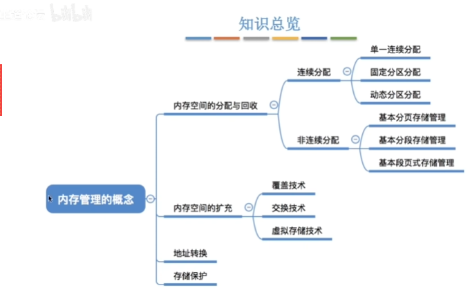

* 虚拟内存 也是一种能够进行内存扩充的技术。
  内存扩充：覆盖技术、交换技术、虚拟存储技术。

​		虚拟内存是基于`高速缓存`的思想提出来的。

* 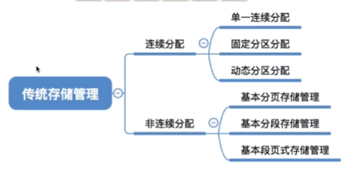

  传统存储管理方式的特征、缺点：
  `一次性`：`作业必须一次性全部装入内存之后才可以开始运行。`
  `驻留性`：一旦作业被装入内存，就会一直驻留在内存中，知道作业运行结束。

  缺点：
  `一次性`：导致，很大的作业如果装不下就没有办法运行。当大量程序运行的时候，只有少部分的作业能装下可以运行，`多道程序并发度下降`。
  `驻留性：`举一个例子，一个游戏，在场景A中，不需要场景B的一些数据，但是会把场景B的数据也放进去。事实上，一个时间段内，往往只需要访问一小部分的数据就可以正常运行，就导致`内存中会驻留大量的、暂时用不到的数据，浪费内存资源。`

* 局部性原理：
  
  基于局部性原理，提出来了`高速缓存`技术：
  **使用频繁的数据**会放到更加高速的存储器中。

* 使用虚拟内存的特征：
  1.基于局部性原理，在程序装入的时候，**可以把程序中很快就会用到的部分装入内存，而把暂时用不到的部分留在外存，就可以让程序开始执行。**
  2.在程序运行过程中，**如果需要访问的信息不在内存，就由OS负责将所需要的信息从外存调入内存**，继续执行程序。
  3.如果内存空间不够，**由OS负责把内存中暂时用不到的信息调到外存。**
  4.在OS的上述管理下，在用户的角度，就会得到一个看似比实际内存大得多的内存，就是`虚拟内存`。

  虚拟性：内存其实并没有在物理层面扩大，但是在逻辑层面扩大了，在逻辑上进行了扩充，就是虚拟性。

  虚拟内存的几个主要特征：
  1.多次性：无需作业运行的时候一次性全部装入内存，允许被分成多次调入内存。
  2.对换性：在作业运行的时候不需要一直常驻内存，允许作业在运行的过程中，将作业进行换入、换出。
  3.虚拟性：在逻辑上扩充了内存的容量，使得用户看到的内存容量远大于实际的容量。

  `多次性` 对应上面的 一次性，对换性对应上面的`驻留性`。 

* 如何实现虚拟内存技术：
  如果使用`连续性内存分配技术`，一个作业多次调入内存，但是多次调入之后还是连续的，明显不合理、很难做到，所以`虚拟内存技术`基于`离散分配的`内存管理技术。
  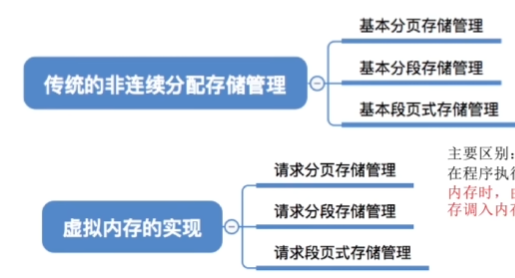

  实现虚拟内存技术的三种方式和`非连续性内存管理的三种方法是对应的`。

  主要区别：
  1.在程序执行的过程中，`当访问的信息不在内存`，需要os将需要的信息调入内存，之后继续执行。
  2.如果内存空间不够，由OS负责将内存中暂时用不到的信息换出外存。

  所以OS要在原来的基础上新增一些功能：**请求调页**，**OS要提供页面置换功能**。
  请求调页：将信息从外存调入内存。
  页面置换：将内存中暂时用不到的信息换出到外存。通过置换把暂时用不到的分页、分段换到外存中。

  如果是分段存储管理方式就需要新增`请求调段、提供段置换功能`。

## 3.2_2_请求分页管理方式

* 首先，因为请求分页管理和基本分页管理不一样，所以会多很多 需要存储的属性，明白属性的作用，然后明白 请求分页和基本分页的区别。

  掌握请求分页管理方式的 地址变换过程。
  掌握其实就是掌握和`基本分页管理方式`的不同。
  能够分清楚，缺页中断是内中断。

  **这一节课的内容，重点在于理解，但是需要能说出来，感觉和会背也没什么区别。**

  

* `请求分页管理方式`在基本分页存储管理方式上添加了`请求调页`(如果访问的数据不在内存中，要从外存调进来)和`页面置换`(如果内存满了，就要在内存中找一个页面进行置换)两种功能。

* 页表机制：
  需求：在`请求分页管理方式中`，OS需要知道**这个页面是不是在内存里面**，还需要知道**在外存中的位置**，在`页面置换`中，可能是根据一些指标来暗指优先级，而这样的指标也需要存储下来，需要**存储一个页面有没有被修改过**，因为一个没有被修改过的页面在最后调入外存的时候不需要修改，但是一个已经修改过的调入外存的时候，是需要覆盖原先的外村的旧数据的。

  所以在`请求分页存储管理方式`中需要添加：
  状态位(是否调入内存)，访问字段(记录一些指标)，修改位(数据是否修改过)，外存地址(在外存的存放位置)。
  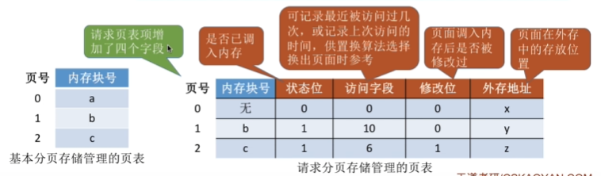

* 缺页中断机构：
  在地址转换中，假设当前想要访问页面0，先检查`0号页面`是否在内存中，如果不在需要产生`缺页中断`，然后让OS的`缺页中断处理程序`来处理这个中断。中断发生后，当前进程阻塞，放入阻塞队列，调页完成之后再被唤醒，放回就绪队列。

  在`请求调页`之后，先检查内存中有没有空余页框、内存块，如果有直接放进去；如果没有就通过`页面置换算法`先将内存中的一个页面淘汰，如果这个页面被修改过，就需要写回外存。把请求调入的页面覆盖这个页面。

  **缺页中断的特性：**
  因为当前执行的指令先要访问的目标不在内存中，而引起中断，所以是**`内中断`。**

  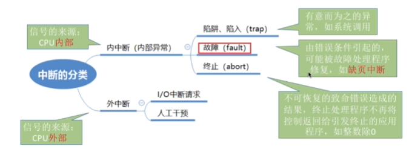
  一个指令如果要访问不止一次地址，就可能会引发不止一次`缺页中断`。

* 请求分页和基本分页的主要区别：
  1.请求分页管理方式中需要请求调页，需要检查当前的内存中有无目标页面。
  2.需要进行页面置换，（如果需要调入，并且没有空闲的内存块的时候）。
  3.需要修改`请求页表`中新增的表项，**在页面调入、调出、访问的时候，有关的页表项需要进行修改。**

* 在访问地址中的主要区别：
  得到访问的目标页面的页号之后，会首先访问快表，如果找到就直接找到。如果没有找到就去慢表里面寻找，如果慢表里面没有，就`缺页中断`，请求调入，可能页面置换。（如果被置换的页面在快表中存储了，就需要把快表中它的相关信息删除掉，因此就说明了：快表中的页面号对应的页面一定在内存中）。

  在请求分页管理方式的快表中也会比`基本分页管理方式`的快表多一些`表项`。

  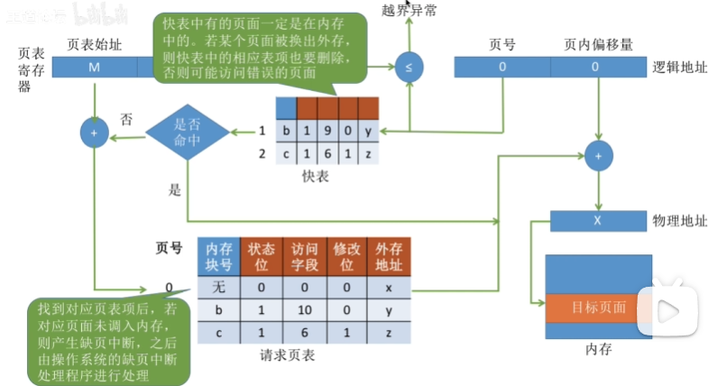

* 请求分页的地址变换过程和一些补充的细节：

  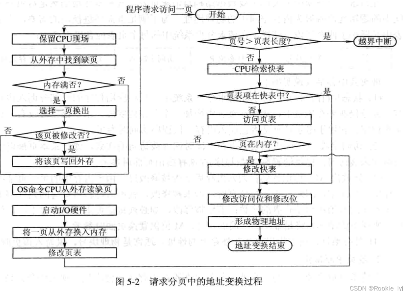

  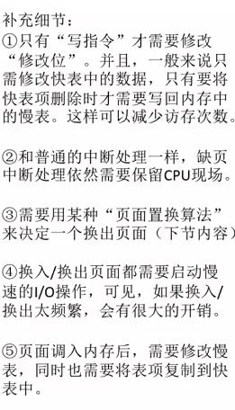
  **在内存调入之后，也会写到快表里面，之后会访问快表，再往下运行。**
  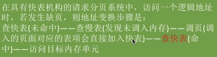

  

## 3.2_3_页面置换算法

* gxy总结：
  改进型号的时钟置换算法，王道中的视频好像有问题，找了一个博客的笔记。
  理解一下clock,改进的clock。分清楚FIFO,lru,opt。各自对应什么情况。

  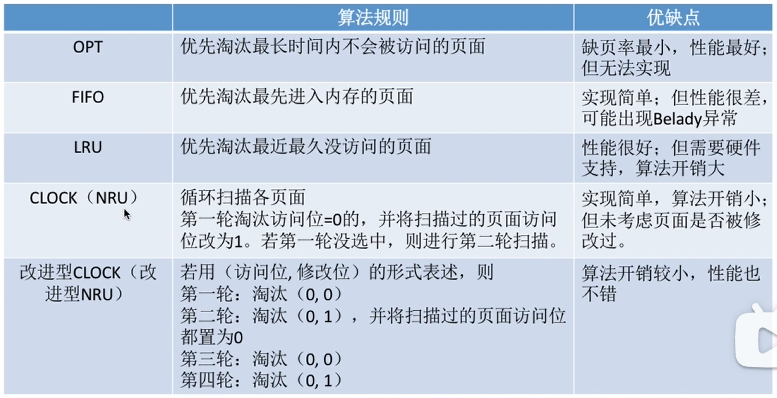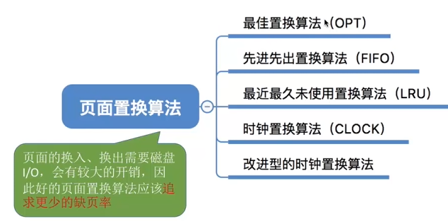
  了解每一种算法的思想，还要记住，英文缩写。

* 页面的换入、换出需要磁盘I/O，会有较大的开销，因此好的页面置换算法应该**最求更好的缺页率**。

* OPT：每次选择淘汰的页面是`最长时间内不会被访问到的页面`。
  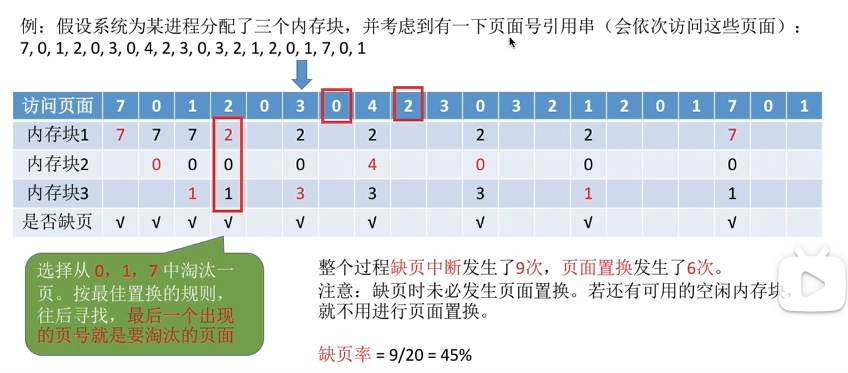

  `缺点`：只是理想上的算法，因为实际上无法很好的预判之后所有的页面访问序列，所以是`无法实现的`。

* FIFO：先进先出算法：每次淘汰的页面是`最早进入内存的页面`。

  用普通队列，就可以实现。
  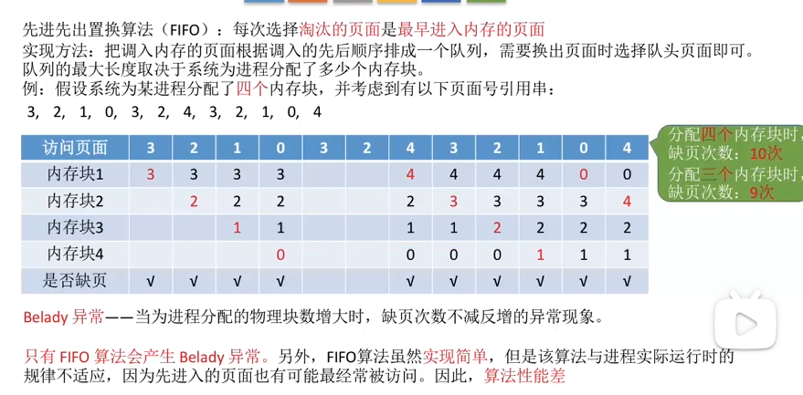
  缺点，会产生Belady异常，内存块明明变多了，但是缺页次数还会增多。
  **只有FIFO**会发生Belady异常。
  `优点缺点：`算法实现比较简单，但是与进程规律可能不适应**，算法性能差。**

* LRU：最近最早未被使用过。每次淘汰的是`最近最久未被使用的页面`。
  需要借助priority_queue才能实现。
  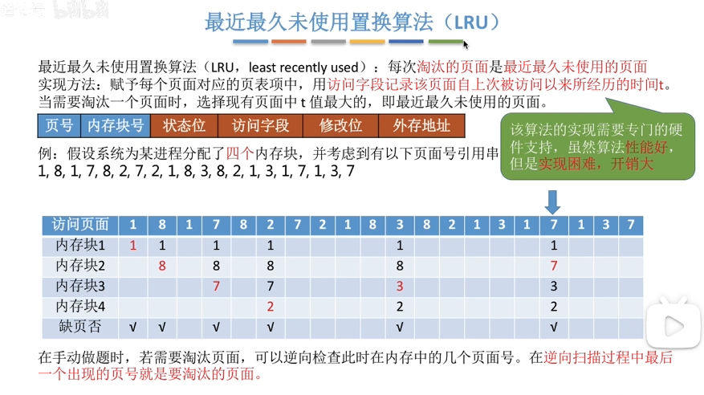
  **算法性能很好，但是实现困难，开销比较大。**
  
* 时钟置换算法：CLOCK。（最近未用算法）
  实现：为每一个页面设置一个访问位，将内存中的页面通过`链接指针`链接成一个循环队列。当某页被访问的时候，访问位置为1，需要淘汰一个页面的时候，只需要检查页的访问位。如果是0，就该页换出，如果是1，就置为0，继续往下检查。

  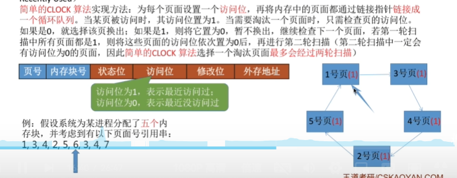
  如果上面过程不是很理解，可以看王道视频`3_2_3 16：00`

* 改进型的时钟置换算法：
  如果一个页面没有被修改过，如果它被淘汰，不需要执行I/O操作，放到外存，所以我们改进上面的CLOCK，让没有被修改过的页面的优先级最高，如果存在没有被修改过的页面，一定会让没有被修改过的优先被淘汰。
  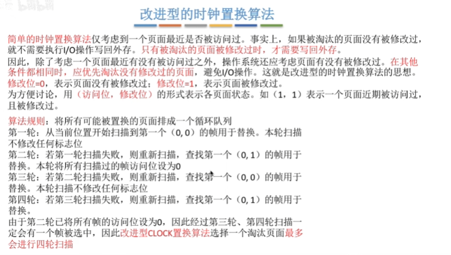
  视频里面，也会有例子展示。
  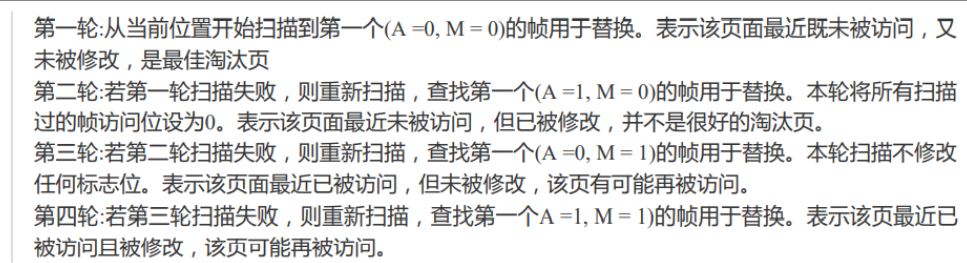
  总觉得上面的笔记有一些问题，还是用这个吧。

  描述：
  首先，找0,0.如果没有。就找1,0.第一个的意思是最近有没有用被访问过，找不到的话，就把(1,1) ->(0,1)。前面操作完了之后，第一维度不可能有1，之后再找一下(0,1)。
  前面两轮一定把没有修改过的找到了，如果还继续说明剩下的页面都是修改过的，所以第二维度直接目标变为1即可，然后把前两轮的过程再重复一遍。

