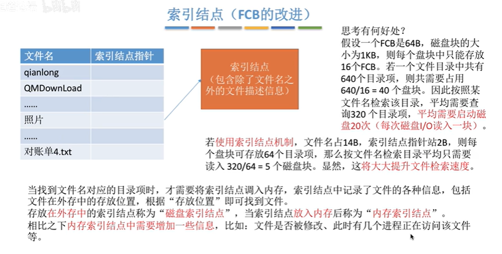

4.1_1_初识文件管理
---

文件就是一组有意义的**信息/数据集合**

* gxy总结：这一节的内容只是引入的作用。 
  
  这一节完全就是这一章的一个很好的引入，可以之后学完之后再回来看。

* 文件的属性：
  `文件名：`同一目录下面不能有重复的名字。
  `标识符`：系统会为每一个文件提供一个唯一标识符，不过对用户没有可读性。
  `类型：`指明文件类型。
  `位置：`文件存放的路径、在外村中的地址。
  **文件的位置包括两个方面，第一种文件的存放路径，为了让用户使用；第二种是文件在外村中的地址，对于OS使用，对于用户是不可见的。**
  其实每一次打开文件的时候，os需要从外村把文件读入到内存，因此OS需要知道文件在外村中的位置。
  `大小、创建时间、上次修改时间`
  `保护信息：`对文件进行保护的访问控制信息。不同的分组对于一个文件的权限不一样，这个保护信息可以让文件更加的安全。

* 文件内部的数据是怎样连接起来的？

  * 无结构文件：比如txt。由一些一系列**二进制或者字符流**组成，又称为`流式文件`。
  * 有结构文件：比如数据库、excel。由一组相似的记录则称，又称为`记录式文件`。
    有结构文件是一个一个记录组成，每一个记录里面可能由很多数据项的。
    

* 文件之间如何组织起来？
  windows中的文件是通过树形结构来组织连接起来的。
  
  用户可以自己创建一层一层的目录，各个目录中放对应的文件。

* 讨论一下，OS应该向它的上层提供哪些功能？
  1.创建文件，在背后进行了"create系统调用"。
  2.可以读文件，将文件从外村读入内存，让cpu处理。双击之后打开，提供`读文件功能，`也就是`read系统调用`，将文件从外存读入内存。
  3.可以写文件。将更改过的文件数据写回到外存。点击保存之后，应用程序通过OS的`写文件`功能，`write系统调用`将文件数据从内存写回外村。
  4.删除文件。`delete系统调用`，将文件数据从外存中删除。
  

  

  

* 文件的物理结构 探讨的是 文件要存储在哪里
  文件的逻辑结构，是文件的各个记录在逻辑上应该是什么关系？

4.1_2_文件的逻辑结构
---

* gxy总结：
  了解 逻辑结构 物理结构 讨论的是什么问题 
  掌握什么是 无结构 有结构 文件 掌握有结构文件的组成： 若干记录 若干记录又是若干数据项。

  定长记录 顺序文件 可以随机存取。
  **顺序文件的最大缺点：**不方便增加、删除数据。

  明白 顺序文件、索引文件、索引顺序文件的组成。

  **需要会计算**在索引顺序文件里面的平均查找次数。

所谓的文件的`逻辑结构`：就是在用户看来，文件内部是如何连接的；
所谓的`物理结构`：是在os看来，文件的数据如何存储在外村中。

上节说过，文件可以分为有结构文件和无结构文件，这里主要讨论有结构文件的情况。
不需要讨论 流式文件的 逻辑结构的问题。

`有结构文件：`由一组相似的记录组成。每一个记录有若干个数据项。一般每一个记录里面可以有一个数据项作为关键字。
有结构文件可以根据，记录的长度是否可变分为`定长记录`和`可变长记录`。

* 讨论有结构文件的逻辑结构问题：

  * 顺序文件：
    文件中的记录时一个接一个的逻辑上的顺序连接，记录可以是定长或者可变长的，物理上可以是`顺序存储`与`链式存储`，很像线性表、链表。

    在顺序文件中，可以根据记录之间的顺序和关键字有没有关系分为：`串结构`：记录之间的顺序和关键字没有关系，`顺序结构`：记录之间的顺序按关键字顺序排列。

    问题：
    假设已经知道了文件的起始地址，能不能快速知道第i个记录对应的地址？(也就是实现随机存取)
    另外一个问题，能否快速找到某个关键字对应的记录存放的位置?

    **只有顺序存储并且采用定长记录**，可以实现随机存取。
    

    **要点**：定长记录可以实现`随机存取`，可变长记录不能实现随机存取。

  * 索引文件
    索引文件的引入：上面提到可变长记录在`顺序文件`里面，无法随机存取，显然在实际生活中很不方便，因此索引文件解决了这个问题。

    如何解决：
    **建立一张索引表**。==**索引表是定长记录的顺序文件**==。
    索引表每一个记录里面有一个指针，指向现在文件的地址。
    因为可以实现对索引表里面指针的随机存取，所以也可以实现对记录的随机存取。

    **索引文件**有很快的检索速度，因此可以用于对于信息处理的及时性比较高的场合。

  * 索引顺序文件：

    索引文件的缺点：每一个记录都有一个索引表项，因此索引表有可能很大。

    > 索引顺序文件的组成：

    索引顺序文件是`索引文件`和`顺序文件`的结合。
    会建立一张索引表格，但是不是每一个记录都有一个索引表，而是`一组记录对应一个索引表项`。然后组内通过顺序文件的方式存储。

    
    上面是首先按照首字母进行分组，之后每一个组内进行顺序存储。

* 索引顺序文件检索的复杂度分析：
  如果一个顺序文件有1e4个，那么顺序文件的平均查找长度是5000。
  但是如果每100个一组，一组100个，找到组平均找50组，在组内找到记录平均需要查找50次，所以最后的平均查找次数是100次。

  通过上面的例子，就可以看到索引顺序文件的复杂度有很好的提升。

  在需要的情况下，也可以建立多级索引顺序文件：建立多级索引表格。
  1e6的数据，可以建立100 * 100 * 100的多级索引。

4.1_3_文件目录
---

> 探讨对于OS来说，如何实现文件目录的功能。

* gxy总结：
  

  1.理解FCB其实就是目录文件里面的一个记录项，FCB的目的是实现文件名字和物理地址的映射，以实现按名存取。

  3.==树形结构不便于实现对文件的共享==。
  4.理解索引结点 的这个优化方式 并且 优化的是 在检索的时候可以减少磁盘I/O次数。需要理解为什么磁盘I/O次数会更少。

* 文件控制块：`实现文件目录的关键数据结构`
  打开一个目录，会看到很多新的目录、文件。
  每一个目录都有一个自己对应的`目录文件`。目录文件里的每一条记录都对应一个文件或者目录

  **存储当前目录的`目录文件`中的每一项**就是一个文件控制块。`fcb`.
  fcb的有序集合就是文件目录，一个fcb就是一个文件目录项。
  同时，fcb里面包含了文件的很多重要信息，最重要的是文件名字和物理地址。

  
  在FCB的那么多信息中，最重要的就是文件名字和物理地址。

  ==FCB的作用：==
  **FCB其实就是实现了**文件名和文件之间的映射。使得用户可以按名存取。

* 需要对目录进行哪些操作：
  

* 单级目录结构：
  只允许有一个根目录，其他必须是文件。
  两级目录结构：
  根目录下面存放用户目录，用户目录下面只能有文件。

* 多级目录结构：树形目录结构
  每一个目录下面可以有更低一级的目录结构，同时在每一个目录下面都可以有文件，不同目录下面的文件的名字可以一样。

  在多级目录结构中的I/O操作次数：
  对于"/照片/2015/自拍.jpg"。
  首先读取本身根目录的目录表（一次I/O），之后查询照片目录的目录文件(2次)、之后再查询2015的目录文件(3次)找到自拍.jpg。所以总共三次I/O操作。

* 树形结构不利于文件共享，因此有了无环图目录结构。
  

  可以用不同的文件名指向同一个文件，甚至同一个目录。
  也就是两个目录可以同时共享一个文件甚至共享下面的目录。在多个共享之后，删除就变得麻烦，可以设置一个`共享计数器`，在一个用户删除文件的时候，把文件对应的共享计数器减一，但是不会直接删除这个共享的文件。只有共享计数器为0，才会删除。

* 索引结点：
  
  
