## 5.1IO设备的概念

引入：（一些宏观上的东西）

OS不仅需要对上层`软件`进行管理，还需要对下层`硬件`进行管理。
OS对存储器、处理机进行管理，这些硬件都是计算机内部的硬件。
IO设备要探讨的就是计算机对于`主机外部设备`的管理。

* gxy总结：
  什么是I/O设备
  按照信息交换的单位进行分类可以如何分？
  以及两者的区别：
  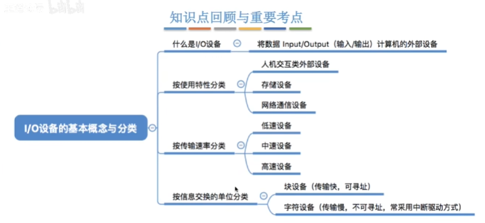

  按照速度和使用特性的分类不需要掌握。

* 什么是I/O设备：
  **就是可以将数据输入到计算机，或者可以接受计算机输出数据的外部设备。**
  **属于计算机的硬件部分。**

  unix系统会把外部设备抽象为一种特殊的文件，用户可以使用与文件此操作相同的方式对外部设备进行操作。
  write操作：向外部设备写出数据。
  read操作：从外部设备读入数据。

* I/O设备的分类：
  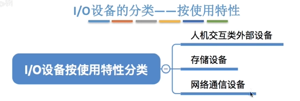

  1.人机交互类设备： 鼠标、键盘。（数据传输速度很慢）。
  2.存储设备：光盘、移动硬盘。（数据传输速度快）。
  3.网络通信设备：用于网络通信。（数据传输速度介于上面两者之间）。

  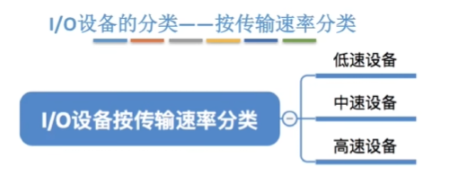
  不过这个速度没有一个明确的划分，所以**基本不会考察。**
  低速度设备：鼠标、键盘。中速度设备：激光打印机。高速设备：磁盘。
  
  ==块设备的传输速率比较高，而且可以寻址。
  `可以寻址的意思：`可以随机的读写任意一块。
  块设备：比如磁盘。
  字符设备：鼠标、键盘。
  两者进行信息交换的单位也不一样，分别是块和字符。==

## 5.2 IO控制器

* gxy总结：
  I/O设备的组成是什么？
  I/O控制器的作用是什么？(中介)
  两种寄存器编址方式对比？
  有一个印象：I/O控制器的功能，I/O控制器的组成，I/O控制器的工作流程。
  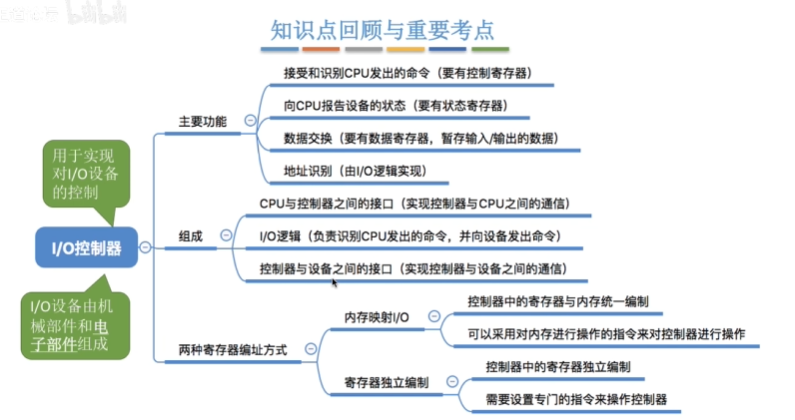
* 
  `机械部件功能`：执行具体的I/O操作。
  `电子部件功能`：通常是一块插入主板扩充槽的印刷电路板。
  ==I/O控制器就是`cpu`和`I/O机械设备`之间的“中介”。==
  ==帮助cpu实现对于I/O设备的控制==。
* I/O设备的功能：
  因为是cpu和机械部件的中介，1.需要接受和识别cpu发出的命令。为了管理设备，2.需要向CPU传递设备的状态。3.需要进行数据的交换。4.需要进行地址的识别。通过I/O逻辑来实现，通过地址的识别，才知道cpu想要操作的是哪里，要在IO控制器哪里存储指令有关的信息，设备有关的状态。

* 功能解释：cpu是无法直接控制机械部件的，需要通过电子部件来实现对于设备的控制。
  IO控制器里面会有寄存器来存储命令和参数。
  IO控制器里面也有状态寄存器来记录设备的当前状态。
  有时候需要数据交换，要求IO控制器有`数据寄存器`。用来暂存 输入、输出的数据。
  设备控制器需要能够识别cpu提供的地址来判断要读/写的是哪一个寄存器。设备控制器里面的每一个寄存器也需要给各个寄存器设置一个特定的地址。 
  `地址识别`：cpu需要给io控制器里面的寄存器写东西，所以io控制器就需要知道cpu此时是需要写到哪里，所以io控制器需要有地址识别的功能。

* io控制器的组成：
  1.与cpu的接口。2.io逻辑。3.与机械部件的接口。

  > 对于台式机来说，对于键盘：机械部件就是键盘本身，电子部件也就是IO控制器是通常位于主板上面，不过键盘里面也会有一个电子部件：键盘控制器。来将按键的机械操作转换为电信号，再通过特定的协议发给主板。

  io逻辑：
  负责接受和识别cpu的各种命令。
  一个io控制器可能是一个cpu 和很多个设备的中介。为了区别是哪一个设备。

  过程：
  1.cpu首先通过控制线，向IO控制器发出一个具体的指令，同时CPU会在地址线上面说明自己要操作的是哪一个设备。  2.如果要输出一个数据的话，CPU会通过数据总线把自己要输出的数据放到IO控制器的数据寄存器中，之后IO逻辑就可以从这个寄存器里取出来要输出的数据。   3.此时cpu的io指令可能有一些参数，这些参数会放到IO控制器的一些寄存器当中，之后io逻辑会从这些寄存器里面读出来相应的参数。  4.为了实现对每一个设备的管理，cpu中还会从状态寄存器读出来每一个设备的状态。
  io逻辑会往这个状态寄存器里面写入数据高速cpu，当前设备的状态。  5.IO逻辑会把这些需要操作的信息通过线路传送给`控制器与设备的接口`。
  上面的过程再用IO设备进行输入的时候刚好反过来。

  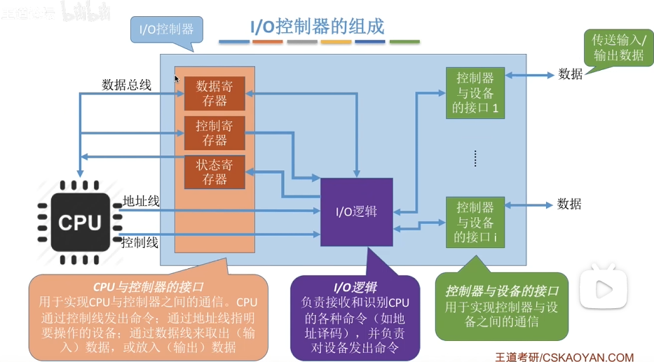

  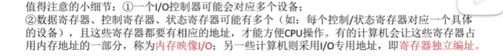

* 两种寄存器编址方式对比：
  I/O控制器里面可能有多个寄存器：数据寄存器、控制寄存器、状态寄存器等等。
  对于这些寄存器的编址方式，分为：
  1.`内存映像I/O`。让寄存器占用内存的一部分。
  2.`寄存器独立编址`。采用I/O专用地址。

  区别：
  对于`内存映像`：采用的是控制器中的寄存器和内存地址统一编址。
  对于`寄存器独立编址`：控制器中的reg使用单独的地址。

  `寄存器独立编址的缺点：`
  需要设置专门的指令来实现对于`IO控制器中的寄存器`的操作，不仅需要指明寄存器的地址，还需要指明控制器的编号。
  `内存映像的优点`：
  简化指令。可以直接采用对内存进行操作的指令来对`IO控制器内的寄存器`进行操作。
  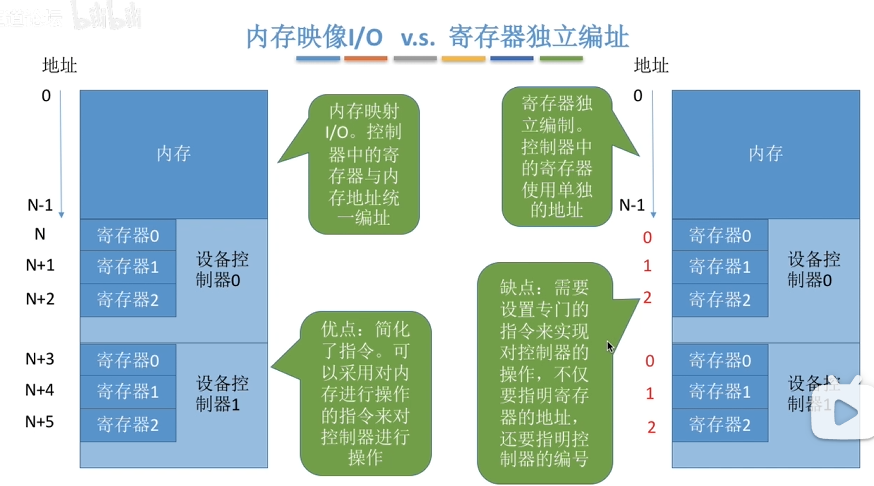

5.3 IO控制方式
---

* gxy总结：
  ==IO控制方式有哪四种？
  对于每一种需要了解大概的读/写操作流程。
  cpu干预的频率对比，数据传送的单位，数据在cpu、设备、内存之间的流向。
  各自的缺点和优点。==

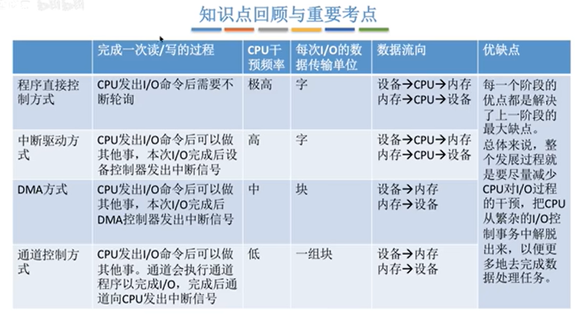

* 程序直接控制方式：
  1.首先`cpu`向IO控制器发出读指令。等待设备就绪(`状态寄存器`会设置为0，代表对应的设备此时就绪)。  2.cpu会`轮询检查`控制器的状态。（本质上就是一个循环，一直往下进行）直到`状态寄存器`的值为0。  3.输入设备准备数据，之后把数据传送给`IO控制器`，并且报告自己的状态。  4.控制器将输入的数据放到数据寄存器里面，同时将`状态寄存器`设置为0。  5.`cpu`发现设备就绪，可以把`数据寄存器`里面的内容读入`cpu`的寄存器中，之后再从`cpu的寄存器`读入到`内存`里面。

  流程：
  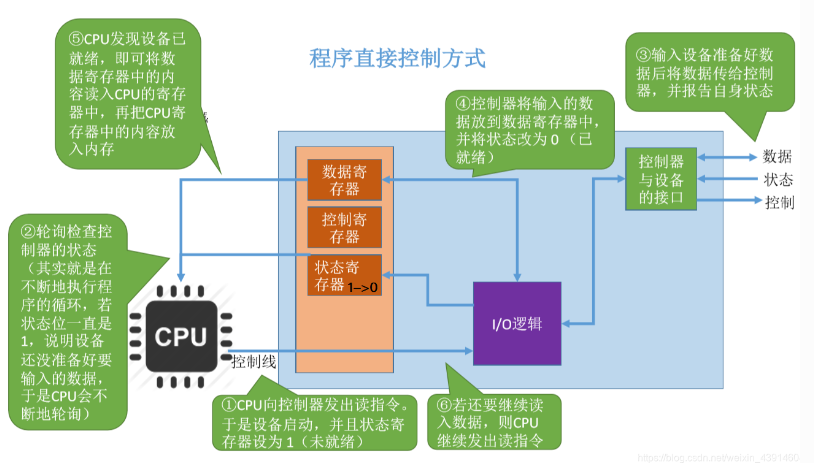
  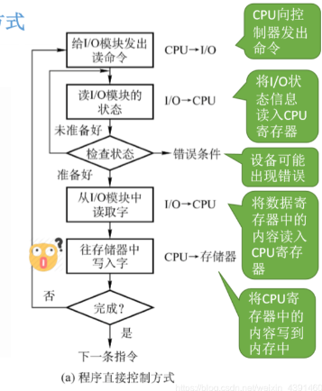

  ==要注意的点：==
  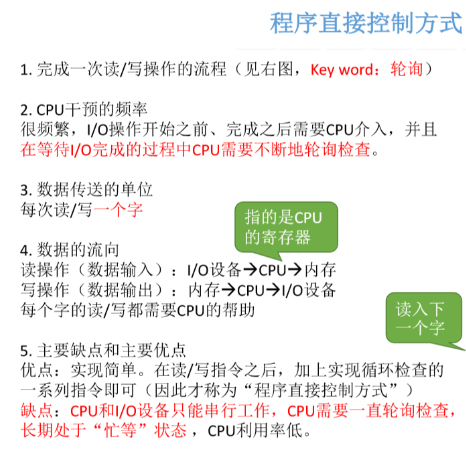

* 中断驱动方式：
  为了解决`程序直接控制方式`里面cpu利用率低的问题。

  流程：在上面`程序直接控制方式`的基础上面，添加`中断机制`。
  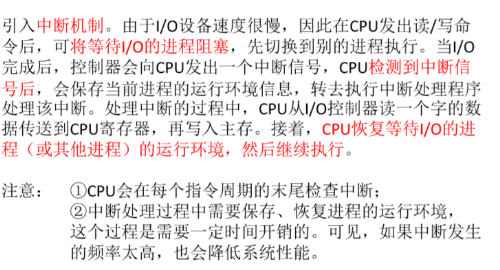

  ==需要注意：==
  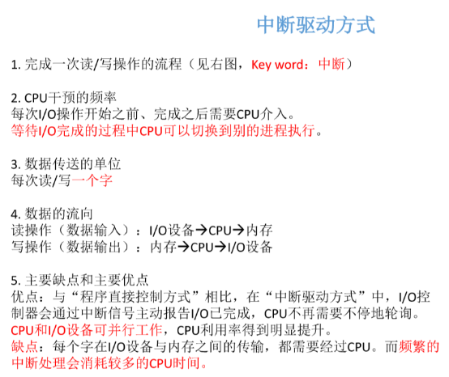
  主要优缺点：
  优点：不需要轮询，cpu和IO设备可以并行工作。
  缺点：一个字是一次中断，频繁的中断会消耗很多cpu的时间，开销很大。

* DMA方式：
  上述的`程序直接控制方式`和`中断驱动方式`每一次只能读/写一个字，效率太低。

  DMA方式：direct memory access`直接存储器存取`。
  数据的传送单位是`块`。不是一个字。
  `数据的流向`：直接从设备放入内存，或者内存直接到设备。不再需要中间经过cpu。
  仅仅在传送数据块开始或者结束的时候需要cpu的干预。
  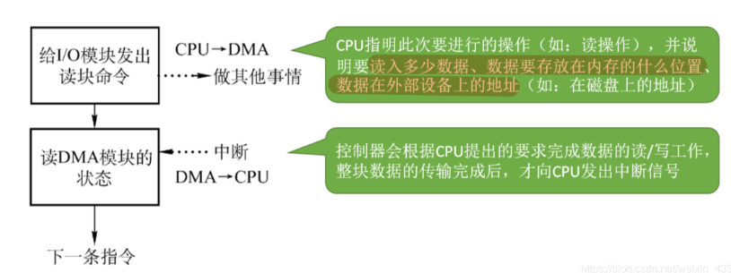
  cpu把指令传递给io控制器，告诉io控制器需要进行的操作(多少数据，数据在外部设备的位置、在内存的位置)。然后cpu就会做其他事情，这个进程进入阻塞状态。之后`控制器`根据cpu指令完成读/写操作，完成之后向`cpu`发出中断信号。

  过程的一些详细细节：(这里可以不看，估计不会考察这么详细)
  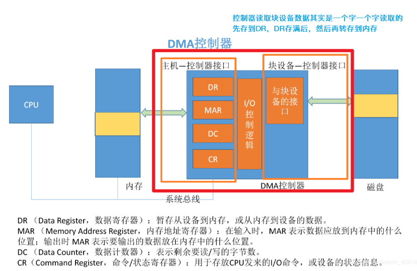

  ==DMA方式特点：==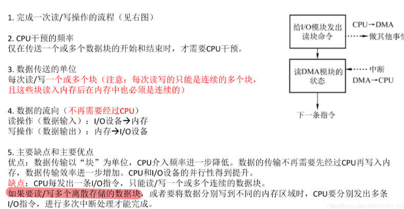

  以块为单位，cpu的介入频率大大降低。同时数据的传输不需要cpu在中间当作媒介操作。
  缺点：对于`一条cpu指令`，每一次只能读写一个或者多个连续的块，放到内存里面也必须是连续的位置。

* 通道控制方式：
  `通道控制方式`设立的原本目的是为了解决`dma`里面不能必须连续存储的问题。
  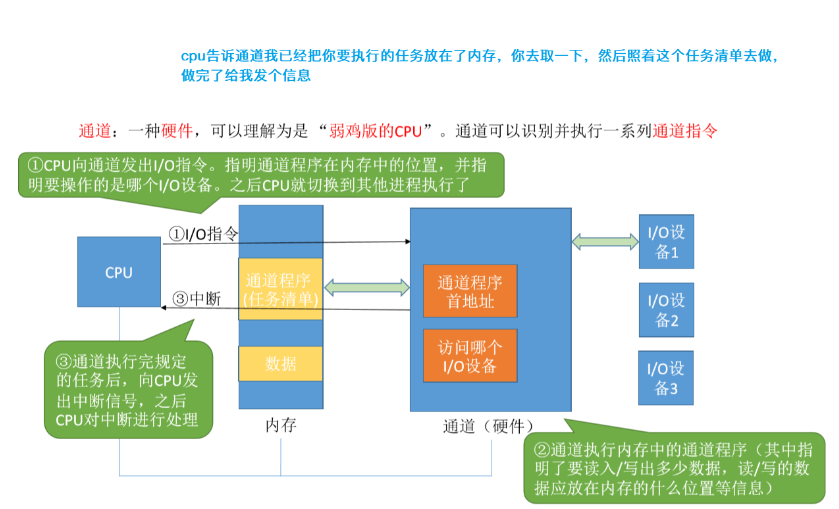
  通道是一个硬件，可以理解为弱化版本的cpu，cpu把指令传递给`通道`，cpu就可以做别的事情了，通道会按照cpu指令的要求来完成数据的读/写。完成之后再告知cpu。

  ==通道方式特点：==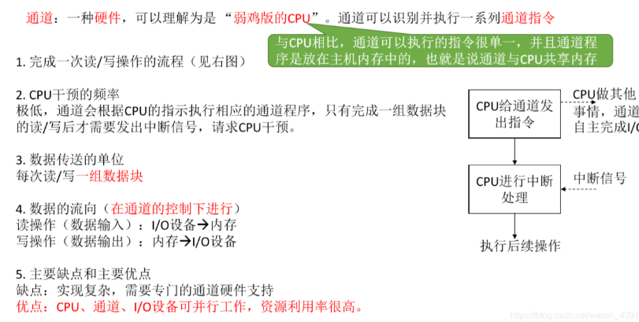
  通道方式优点和缺点：缺点：实现复杂，需要新的硬件支持。
  优点：cpu资源利用率很高。

## 5.1.4 IO软件层次结构

* gxy总结：
  掌握IO软件层次有哪五层，各自的顺序。
  越往上越接近用户，越往下越接近硬件。
  理解各自的功能。

  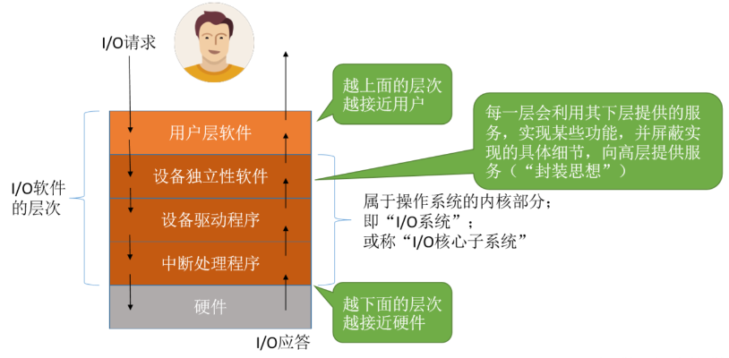

* IO软件层次介绍：
  IO软件层次包括：用户层软件、设备独立性软件、设备驱动程序、中断处理程序、硬件。
  越上层越靠近用户，越下层越靠近硬件。
  其中`设备独立性软件、设备驱动程序、中断处理程序`属于OS的内核部分，也就是IO系统。
* 各部分理解：
  用户层软件`实现了与用户交互的接口`，比如需要给用户提供给io操作有关的库函数。
  然后`用户层软件`需要来对硬件操作，所以要利用`设备独立性软件`提供的`系统调用`。所以`用户层软件`会使用`设备独立性软件`向上提供的`系统调用接口`来请求操作系统内核的服务。
  `设备独立性软件`功能：
  1.向上层提供统一的`调用接口`，比如read/write系统调用。
  2.实现设备的保护。（这里的保护，如果把设备看作文件，每一个用户的权限应该是不一样的）
  3.差错处理。
  4.设备的分配和回收。
  5.数据缓冲区管理。
  6.建立逻辑设备名到物理设备名之间的映射关系。（用户看到的设备名称就是逻辑设备名称，实际上os会对应到物理设备名称，这个映射是通过`逻辑设备表`来实现的。）

> 缓冲技术是用来：**屏蔽设备之间数据交换单位大小和传输速度的差异**。

* 不同的设备需要不同的驱动程序。因为不同型号的电子部件可能完全不一样（比如状态寄存器1代表空闲、忙碌都是有可能的）。所以需要有不同的驱动程序。

  `设备独立性软件`不可以直接操纵硬件，必须调用厂家提供的`设备驱动程序`，来完成对硬件的具体控制。（驱动程序一般会以一个独立进程的方式存在）

  `中断处理程序`：进行中断的处理。

* `用户层软件`实现与用户的接口。
  `设备独立性软件`向上层提供统一的调用接口。
  `设备驱动程序`：设置设备寄存器、检查设备状态等**直接涉及到硬件的操作**.
  `中断处理程序`：涉及到和硬件有关的中断处理。
  `硬件`：执行I/O操作。

  ==首先是用户层软件,实现与用户交互的接口，提供I.O操作的库函数。但是它不能直接操作硬件，要利用`设备独立性软件`提供的系统调用。独立性软件有一个重要功能是映射逻辑设备和物理设备。之后因为不同的硬件电子部件结构不一样，所以需要设备驱动程序来操作，设备驱动程序做的工作涉及到直接硬件层面、同时和中断无关。还会有中断处理程序来处理中断。最后是硬件。==

5.1.6 输入输出应用程序接口和设备驱动程序接口
---

* gxy：
  这里因为是新考点，估计面试不会考，所以就没有详细记录。
  只是从理解层面记录一些要点。

`设备独立软件`给`用户层软件`提供的系统调用是无法统一的，因为对于I/O操作，操作的对象可能是字符设备、块设备、网络设备，三者各自的特性各不相同，每一个需要的系统调用也是不一样的。

* 对于网络设备的操作：
  电脑里面有网卡，网卡就是网络控制器，要进行网络数据包的收发。
  不同的数据包应该给不同的应用程序，比如有的数据包给vx,有的给支付宝。
  为了区分不同的数据包，`网络设备接口`（`套接字接口`）会给上层的用户层软件提供`Socket系统调用`：创建一个网络套接字。
  创建网络套接字的同时：还需要指明传输层协议：UDP\TCP.
  bind系统调用：把套接字绑定到本地的某一个端口。(而计算机的ip地址+端口就可以映射到一个具体的应用程序)
  connect系统调用：将套接字连接到远程地址。
  [5.1_5_输入输出应用程序接口和驱动程序接口_哔哩哔哩_bilibili](https://www.bilibili.com/video/BV1YE411D7nH?p=75&vd_source=6665b230bfe546f54aebd357560da556)视频关于这一块做了详细的例子解释。

**套接字**：计算机进行通信的编程接口。

* 阻塞I/O：应用程序发出I/O系统调用，之后进程会转换为`阻塞状态。`
  非阻塞I/O：应用程序发出I/O系统调用，系统调用可以迅速返回， 进程无需阻塞等待。比如往磁盘写数据，发出调用之后，即使磁盘现在忙碌，设备独立性软件层也会迅速相应，然后先把数据复制到内核层次，之后再慢慢写回磁盘。不需要阻塞等待。
* 设备驱动程序接口：
  `驱动程序`需要向`设备独立性软件`层次提供一个`统一标准的设备驱动接口`。

