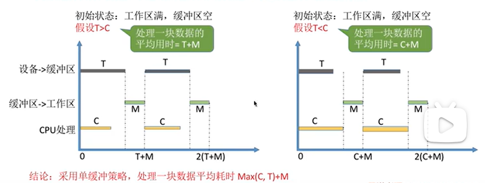

5.2.1 IO核心子系统
---

`IO核心子系统`就是`IO系统`，是操作系统的内核部分，包括：设备独立性软件、设备曲工程序、中断处理程序。

需要掌握：IO调度、设备保护、假脱机技术、设备分配与回收、缓冲区管理。
五种功能的原理和实现。

* IO调度：`设备独立性软件`层次实现。
  IO调度：就是通过某种算法来确定一个好的顺序处理各个IO请求。
  比如先来先服务、优先级算法、短作业优先等等算法。
* 设备保护：`设备独立性软件`层次实现。
  把设备看作文件，每一个设备有FCB。
  用户请求访问设备的时候，系统会根据FCB中的信息来判断用户是否有相应的访问权限，来实现设备保护。（本质上和文件保护是一样的）。

5.2.2 SPOOLING技术
---

* gxy总结：
  掌握：脱机是什么意思。假脱机的大致思想。

  理解：理解脱机技术的过程
  类比脱机技术明白假脱机技术。
  理解共享打印机的原理。

* 脱机技术：
  原先在手工操作阶段，使用纸带机进行输入输出，`主机直接从I/O设备`获得数据，两者之间速度差距很大，cpu利用率很低。
  之后借助磁带来实现了`脱机技术`：
  数据先从纸带通过 某种设备(`外围控制机`) 记录到磁带上面，之后通过磁带来和主机进行数据的直接交互，速度就快了很多。输出的时候：主机先把数据放到磁带上面，之后磁带再和纸带进行交互。

  **为什么叫脱机？**
  其实就是脱离主机的控制进行输入、输出的操作。
  **脱机技术的作用：**
  缓解了CPU和设备的速度之间的矛盾，可以实现`预输入、缓输出`。
  

* 假脱机技术：
  是`用软件的方式`模拟脱机技术。
  在磁盘中有`输入井`和`输出井`。在内存中有`输入缓冲区`和`输出缓冲区`。
  同时在输入输出的时候，系统会建立对应的`输入进程`和`输出进程`。

  理解：
  输入井就类似于脱机输入中的磁带，用来收容I/O设备输入的数据。
  输出井类似于脱机输出时候使用的磁带，用来收容用户进程输出的数据。
  `输入进程`：模拟脱机输入时候的外围控制机。
  `输出进程`：模拟脱机输出时候的外围控制机。
  输入、输出缓冲区，在输入/输出进程的控制下，可以暂存输入设备输入的数据/要输出的数据，之后再转存到输入井/输出井。
  

* 假脱机原理的应用：共享打印机：
  打印机是一种独占设备，但是可以通过spooling技术变为共享设备。`允许多个进程同时使用`。
  **实现过程：**

  
  
  假脱机技术的效果：
  虽然只有一个打印机，但是每一个进程提出打印请求的时候，系统都会为其再输出井中分配一个存储区，从进程的角度，就是自己在独占。从而实现打印机的共享。

  **SPOOLING技术**把一台物理设备`虚拟`成逻辑上的多台设备，`可以将独占式设备改造成共享设备`。

## 5.2.3 设备的分配和回收

 `设备独立性软件这一层次需要完成的功能：设备分配和回收`

设备分配的时候需要考虑：设备的固有属性(独占设备、共享设备、虚拟设备)。
分配算法：先来先服务
从安全性角度考虑的分配方式： 安全分配方式，分配一个进程之后一定会进行阻塞，等待Io完成周才唤醒。

不会导致 死锁 但是 cpu io 
不安全分配方式：
比如现在申请打印机，然后得到了资源，直接把数据丢给打印机，进程就继续往下运行了，然后打印机自己慢慢的 打印。

有可能发生死锁。

* 静态分配 和 动态分配 
  静态分配：进程运行之前就分配需要的全部资源，只有进程运行完毕之后才收回。

5.2.4 缓冲区管理
---

* gxy总结：
  掌握缓冲区的优点。
  理解缓冲区的工作原理。
  掌握单缓冲和双缓冲的处理一块数据平均消耗时间的计算。
  掌握使用单缓冲和双缓冲策略对于通信的影响。
  对循环缓冲和缓冲池的原理有印象即可。
  

* 缓冲区介绍：
  缓冲区就是一个存储的区域，可以用专门的硬件寄存器组成，也可以使用内存作为缓冲区。使用硬件作为缓冲区的成本比较高，容量也比较小，一般用在对于速度要求很高的场合。
  一般情况下，更多的都是`使用内存作为缓冲区`。
  在`设备独立性软件`这一层次的`缓冲区管理`就是要组织和管理好位于内存的缓冲区。

* 缓冲区大致过程：cpu可以把要输出的数据快速放入缓冲区，然后cpu可以做别的事情，让缓冲区和IO设备之间慢慢的进行数据交换。
  另外，如果原先没有引入缓冲区之前在cpu和IO设备进行数据交换的时候，如果是以字符为单位，那么每一个字符的数据交换完成之后就需要中断，而引入`缓冲区`可以使得缓冲区内部所有数据都传送完成之后再告诉cpu，此时才引发中断，可以降低中断的次数。而这样也解决了粒度不匹配的问题。（就是比如输出进程每一次生成的数据是一块，但是IO设备每一次只能输入输出一个字符，通过缓冲区就可以解决粒度不匹配的问题，即使粒度不匹配，也会慢慢的进行数据的传送）。

* ==缓冲区作用、优点：==
  1.缓和CPU和I/O设备之间`速度不匹配`的矛盾。
  2.减少CPU的中断频率。
  3.解决数据粒度不匹配的问题。
  4.提高CPU和I/O设备之间的并行性。
  

* 单缓冲：
  ==在进程请求输入若干块的时候，os会`在主存内分配一个缓冲区`。
  **只有缓冲区为空的时候，才会把数据冲入缓冲区。只有缓冲区充满之后，缓冲区才可以把数据传送出去。**==
  
  **计算处理一块数据的平均用时：**

  处理的时候要注意的点：
  我们假设现在缓冲区为空，工作区为满，下一次再次到达这个状态与现在的时间间隔，就是`处理一块数据的平均用时`。
  上面的T 和C是可以同时进行的，但是需要缓冲区为空才可以。
  
  最后单缓冲策略处理一块数据平均消耗时间：
  $$
  max(C,T) + M
  $$

* 双缓冲策略：
  ==在进程请求输入若干块的时候，os会`在主存内分配2个缓冲区`。==

  假设初始状态：
  一个缓冲区满，一个缓冲区为空。
  

  

  如果T > C+M ,T完成之后，缓冲区1的数据也已经给了cpu，就到了初始状态，使用时间就是T。
  如果T<C+m,在一次T之后，传送会等待M结束之后继续传送。但是M需要等待c结束之后再进行传送，上图也可以看到，并不是一个单纯的循环的状态。但是平均处理一个数据块花费的时间是：C+M.

  `双缓冲`策略消耗一个数据块用时：
  $$
  max(T,C+M)
  $$

* 单缓冲和双缓冲在通信中区别：
  **两个主机**都是单缓冲策略，同一时刻数据只能单向传输。
  双缓冲可以给主机配备一个`发送缓冲区+接受缓冲区`，可以实现同一时刻数据双向传输。

* 循环缓冲：
  用`大小相等的缓冲区`组成一个缓冲队列。
  
  当空的缓冲区输入满之后，in指针往下移动。
  当慢的缓冲区的数据清空之后，out指针也会继续往下移动。

* 缓冲池：
  
  刚开始选择一个缓冲区来收容输入，然后放到输入队列队尾。
  在计算进程想要得到一块输入数据的时候，从输入队列对头提取出来一块数据。
  当想要输出一块数据，会从空缓冲队列中选择一个来收容输出。之后放到输出队列队尾。
  然后输出进程请求输出数据的时候，取出输出队列的对头进行输出。

