5.3.1 磁盘的结构
---

* gxy总结：
  磁盘、磁道、扇区、盘面、柱面。
  如何读写数据。
  ==一个磁道上的所有扇区形成一个连续的存储空间。==

  所有内容，理解即可。
  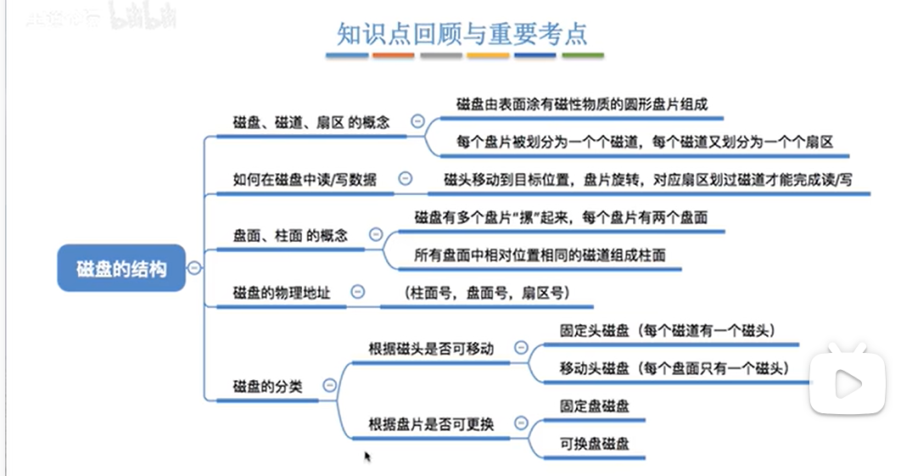

什么是磁盘：表面由一些磁性物质组成，可以用这种物质来记录二进制数据。
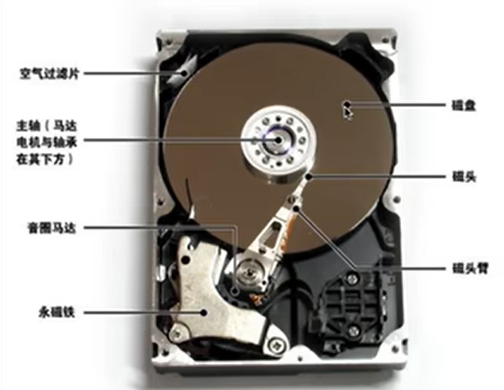

为了读取数据，就需要让磁头移动到对应的位置。
`移动过程`：磁头臂可以带动磁头沿着磁盘的半径方向进行移动，以到达对应的磁道；磁盘会转动。

一个磁盘片：会分为一条一条磁道。最外围磁道的周长最长，但是所有磁道存放的数据量一样。所以最内侧磁道上的面积最小，数据密度最大。一个磁道又被划分为了多个扇区。
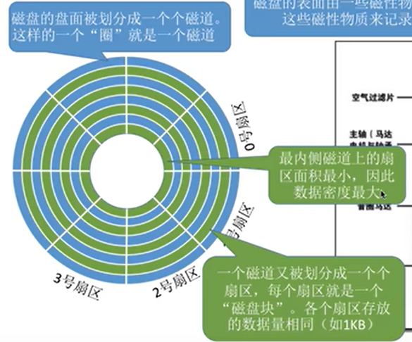

如何在磁盘内读写数据？
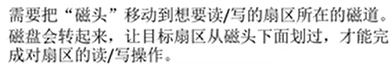

* 一个磁盘由很多的盘片组成；每一个盘面都会有一个磁头；
  所有盘面的同一个磁道，就组成了一个柱面；所有盘面的磁头是一个磁头臂，所以要共进退。
  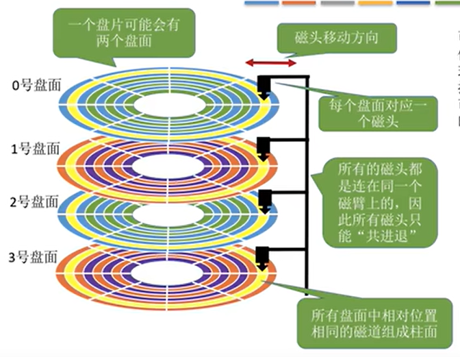
  然后磁盘的物理地址：`(柱面号，盘面号，扇区号)`。然后就可以转换为对应的块号。
  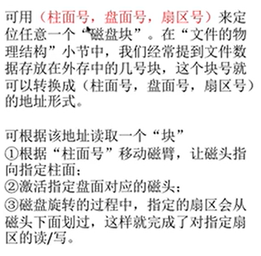

* 磁盘的分类：
  * 磁头可以移动：活动头磁盘。
    磁头不可以移动：固定头磁盘。(每一个磁道都有一个磁头)
    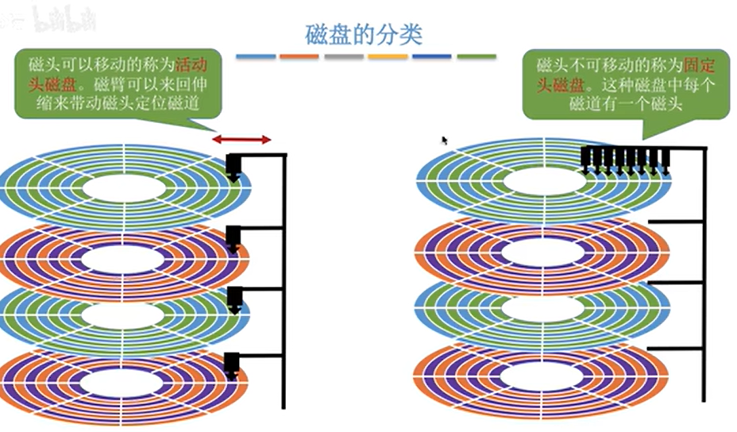
  * 根据盘片是否可以更换：可换盘磁盘、固定盘磁盘。

5.3.2 磁盘调度算法
---

* gxy总结：
  掌握一次磁盘读/写需要的时间。（掌握公式是如何推理的）
  理解四种常见的算法的原理。
  最短时间优先算法会出现`饥饿现象`。

  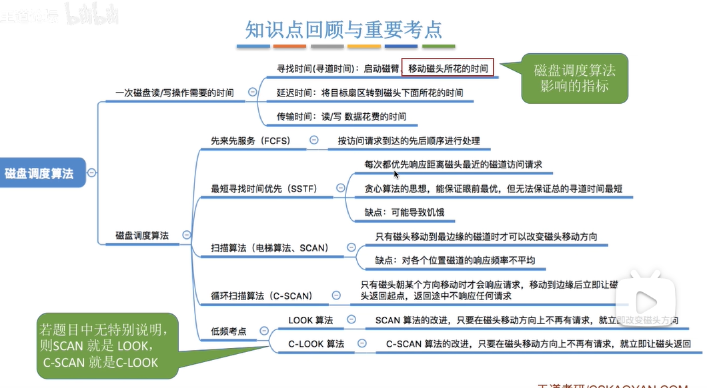

* 一次磁盘的读/写需要的时间：(在理解的基础上，能够推到每一部分的公式)。
  `寻找时间`：寻道时间：就是指在读/写数据之前，将磁头移动到指定磁道会花费的时间。 $寻道时间 = 启动磁头臂时间 + 移动磁头时间$
  `延迟时间`：旋转磁盘使磁头定位到需要读取数据的扇区需要的时间。
  平均为转半圈的时间。r表示转速，$\frac{1}{r}$表示转一圈的时间。

  `传输时间`：从磁盘开始读/写到完毕需要的时间。所以计算传输时间，需要计算需要读取多少个磁道。
  假设需要经过x个磁道，所花费的时间就是磁盘转x圈的时间。
  因为**读写一个磁道的时间，等于转一圈磁盘需要的时间**。
  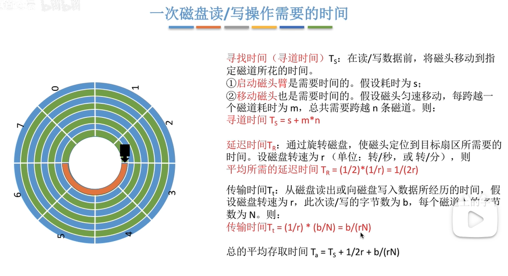

* 上面的 寻道时间 延迟时间 传输时间中，延迟时间和传输时间和硬件有关系，os的调度可以改变寻道时间。

* 寻道调度算法：
  `先来先服务算法`：根据请求访问的磁道的先后顺序进行调度。
  优点：公平，对于请求磁道集中时表现较好。
  缺点：如果请求的磁道很分散，性能就很差，寻道时间很长。
  `最短时间优先算法：`会优先处理`距离当前磁头`最近的磁道。
  优点：性能较好，平均寻道时间短。
  缺点：`可能产生饥饿现象`。
  `扫描算法：`只有磁头移动到最外侧磁道的时候才能往内移动，也只有移动到最内侧才可以往外移动。（电梯算法）
  优点：不会饥饿，性能较好。
  缺点：
  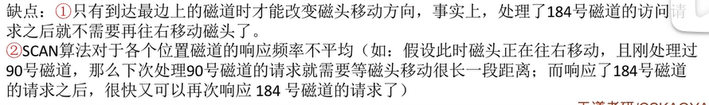

  添加LOOK的算法是低频考点。
  `LOOK调度算法`：如果在当前磁头移动方向上已经没有别的请求，就立即转变磁头移动方向。
  优点：把scan算法的第一个缺点解决了。
  
  `C-SCAN循环扫描算法`：只有磁头朝某一个方向移动的时候才会处理请求。返回的时候不处理请求，直接移动到起始端。
  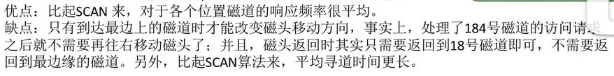
  
  `C-LOOK调度算法`：
  在C-SCAN的基础上，如果当前移动方向上没有磁道需要获取，就转变方向。
  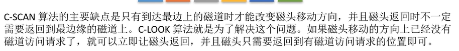
  优点：
  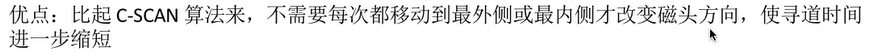

5.3.3 减少磁盘延迟时间的方法
---

* gxy总结：
  掌握什么是延迟时间。
  三种减少延迟时间的方法，理解为什么是这样即可。

  明白在读取完一个扇区之后需要一段时间的处理才能够进入下一个扇区。
  明白：`交替编号`，`错位命名`，`地址结构设计`三种方式的好处。(从反面的角度理解就可以)
  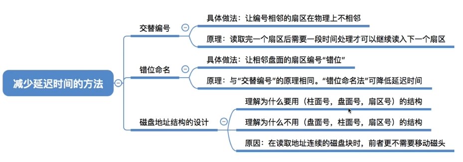

* ==延迟时间：将目标扇区转到磁头下面需要的时间。==
  有一种现象：在当前磁道，当前扇区处理完毕之后，接下来到下一个扇区，但是不能连续读下面的磁道了，因为这个时候需要进行一段时间的处理，如果接下来要读入的数据刚好就在这里，只能等待磁盘转一圈之后重新读取。

* 为了解决上述问题，可以采用`交替编号`。让逻辑上相邻的扇区在物理上有一定的间隔，可以使得获取连续的逻辑扇区所需要的延迟时间更加小。
  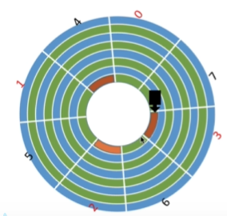
  如图红色部分所示。

* 磁盘地址结构的问题：
  为什么地址是：柱面号，盘面号，扇区号。
  举个例子：现在要获取的地址是：$(00,000,000) \rightarrow (00,000,111)$。0号磁道，0号盘面，扇区从0到7，如果用上面交替编号的方式存储，需要转两圈磁盘就可以获取全部的信息。
  **之后很有可能需要再获取连续的地址：**$(00,001,000) \rightarrow (00,001,111)$。
  按照上面的方式，只是盘面号码变了，而磁盘的结构是这样的：对于一块磁盘里面每一个盘面上面都有一个磁头，这些磁头是共同进退的，所以当前磁道还是对的。（因为磁道都是0号）。
  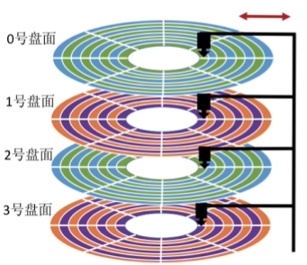

  如果存储方式变为了：盘面号，柱面号，扇区号。
  上面的情况就需要在第二次移动磁头的位置，会带来时间的损耗。

  所以：==采用 柱面号，盘面号，扇区号 的地址结构可以`有效减少`磁头移动消耗的时间。==

* 另外一个方式：错位命名。

  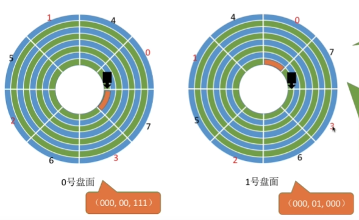
  对于错位命名的解释：对于0号盘面，0号扇区下面对应的是7号扇区。
  解释原因：
  0号扇区下面同样也是0号扇区的情况：读完盘面号码为0当前磁道的数据之后，接下来读取盘面号码为1的数据，此时`磁头的位置如上图左所示`，此时是刚刚号可以接上下一个盘面的0号扇区的。但是因为刚读完了当前扇区，需要通过一段时间的处理，所以现在并不能获取，而现在刚好经过了下一个盘面的0号扇区，所以就出现了问题。
  而`错位命名`，就可以有效避免上述问题。

5.3.4磁盘的管理
---

* gxy总结：
  这一节的内容有印象，理解即可。

  磁盘初始化：需要理解每一步做了什么事情。
  ==掌握计算机开机之后会做什么事情。引导块的作用。==

  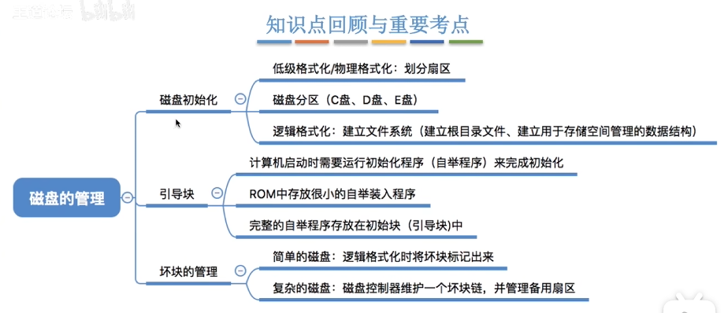

* 什么是磁盘初始化：
  1.在磁盘出厂之前需要进行：`低级格式化/物理格式化`，将磁盘的每一个磁道划分为各个扇区。每一个扇区里面有头、数据区域、尾三部分组成。管理扇区所需要的数据结构一般都放在头尾中。
  2.需要对磁盘进行分区，每一个分区由若干个柱面组成。也就是分为熟悉的c\d\e盘。
  3.进行`逻辑格式化`，创建文件系统。包括创建文件系统的根目录，初始化存储空间管理所需要的数据。
  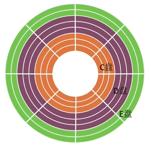

* 引导块：
  在上面初始话之后，就可以存放数据了。

  计算机开机的时候，需要进行一系列的初始化工作，是通过`初始化程序(自举程序)`来完成的。
  ROM是一个`只读存储器`，出厂时就写好了，之后就不能再修改了。 因为rom无法更改，但是自举程序比较复杂，有可能需要进行更改。所以我们选择：==**在ROM中存放一个很小的自举装入程序，完成的自举程序存放在磁盘的`启动块/引导快`里面，引导块必须在磁盘固定位置。**==
  拥有启动分区的磁盘就称为`启动磁盘`。

  `启动块`所在的位置也就是一个启动分区，一般windows都是c盘是启动分区。

  ==所以开机做了什么事情：
  首先运行`ROM里面`的很小的自举装入程序，运行的时候就知道`自举程序`的位置（也就是引导块的位置），然后cpu就可以读取到完整的自举程序，之后完成初始化，开机完成。==

  `ROM是在主板上的电池旁边的一块写着BIOS的芯片。`

* 坏块的管理：
  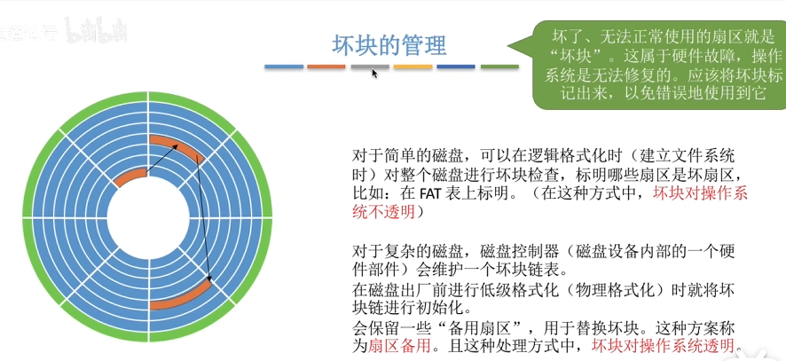

5.3.5 固态硬盘SSD
---

固态硬盘，定位一个逻辑地址的物理地址是通过`闪存翻译层`，通过电路来定位的。所以可以随机访问。
但是机械硬盘，磁盘是通过移动磁头和扇区来做到的，不能随机访问。

固态硬盘的考点只需要掌握下面的一页ppt:

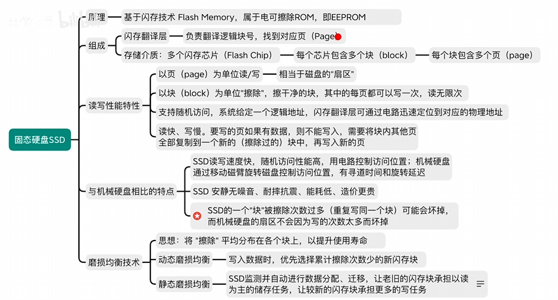
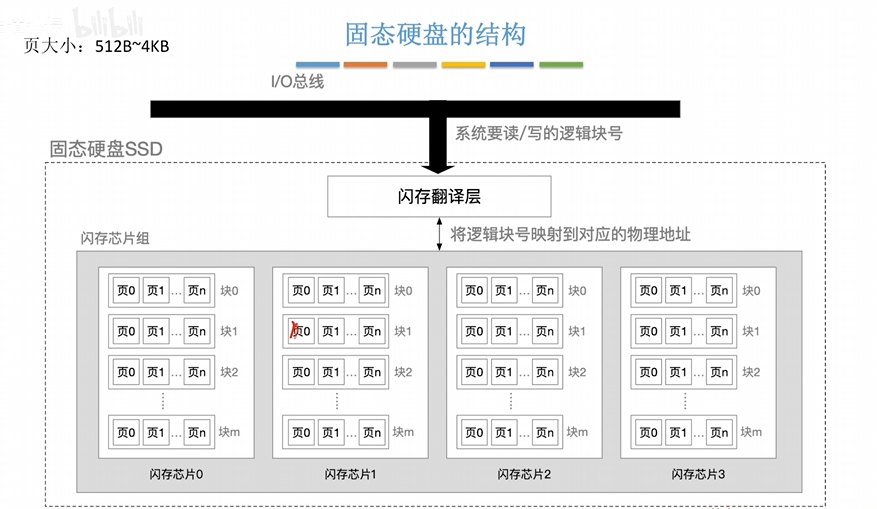

* 内存条就是RAM。

  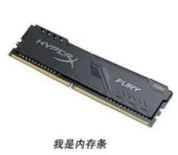
  硬盘包括`机械硬盘`(磁盘)，和固态硬盘。
  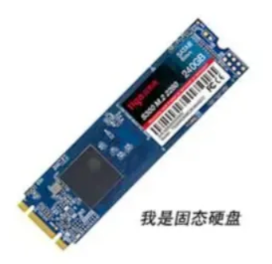
  内存条和硬盘的区别：[傻傻分不清？内存条和固态硬盘区别来了_腾讯新闻 (qq.com)](https://new.qq.com/rain/a/20230424A03H3V00)

  * 有关硬盘的擦除和格式化：
    [您知道硬盘擦除和格式化的区别是什么吗？ (abackup.com)](https://www.abackup.com/easybackup-tutorials/difference-between-hard-disk-erase-and-formatting-666.html)
    格式化只是把控制系统删除了，删除了硬盘上面的文件系统。
    但是数据其实还在，只不过把原来的所有路径都删除了，系统没有办法按照正常的路径来查找到这些文件。

