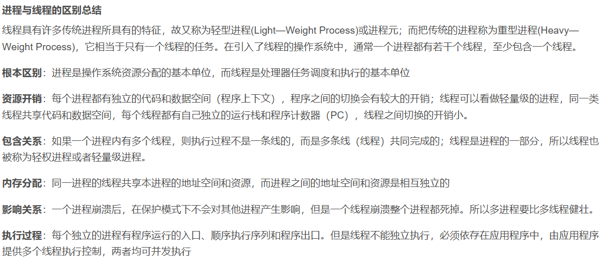
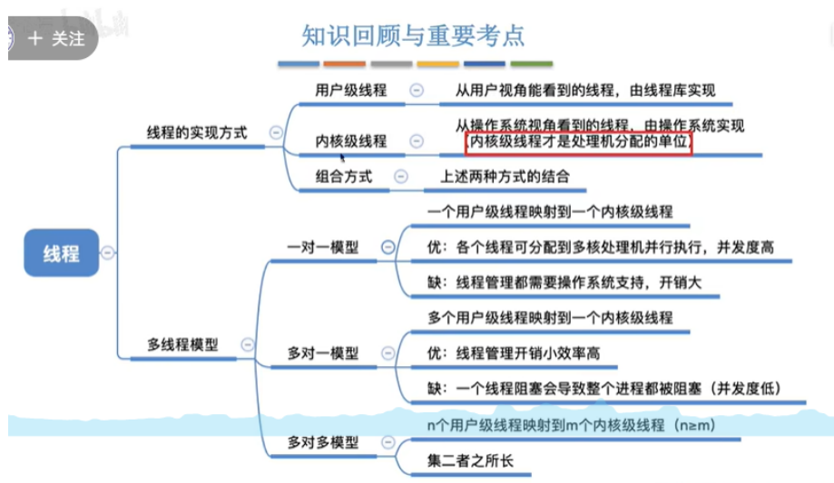
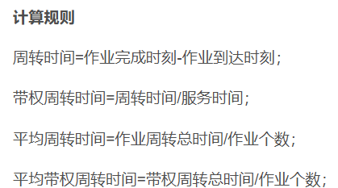

2.1.1
---

1.区分一下进程和程序
2.进程存在的唯一标志
3.进程的组成。各部分存储什么信息。
4.程序是如何运行的。
5.进程的定义。
6.进程的特性。

2.1.2
---

1.进程的状态转换。
2.主动 被动转换的对比。
3.进程的管理方式。

2.1.3
---

1.什么是对进程控制。
2.如何实现对进程的控制。
3.为什么需要原语。
4.原语的种类。(理解)
5.为什么要保存运行环境，如何保存。

2.1.4
---

1.什么是进程通信。
2.实现进程通信的方式有哪几种。
各自简单介绍一下。

2.1.5
---

1.为什么要引入线程。（从用户的角度说明实际的作用）。
2.引入线程之后带来的变化。从执行流、资源分配、并发性、系统开销 多个角度考虑。
3.线程的特征。组成。三种状态。
==重点掌握线程引入之后资源调度、分配的基本单位。线程为什么增加并发度和减少系统开销。==

2.1.6
---

1.线程的实现方式。
2.用户级线程、内核级线程 基本实现原理。
3.上述两种方式的特点：(谁管理，需要核心态否，OS知道有线程吗，优缺点)
4.什么是多线程模型。三种的组成，各自的优缺点。(大概)

2.2.1
---

1.调度的概念。
2.三种调度的做的事情，次数比较。

2.2.2
---

理解为主
1.进程调度的概念。(侠义广义)
2.需要进程调度的情况。(主动 被动)
3.如果访问了`内核程序临界区`，就不能进程调度了。
因为访问临界区会上锁，在解锁之前其他进程都无法访问。

2.2.3
---

1.闲逛进程的介绍。
2.不支持内核级线程的OS，调度程序的处理对象是进程。支持内核级线程的OS，调度程序的处理对象是线程。

2.2.4
---

1.调度算法的评价指标
cpu 利用率，系统吞吐量，周转时间，带权周转时间。

2.2.5调度算法
---

FCFS，短作业优先，高响应比优先。
时间片轮转算法，优先级调度算法，多级反馈队列调度算法。

2.3.1
---

1.死锁的概念
2.区分一下死锁 饥饿 死循环
3.死锁的必要条件。
4.一句话总结为什么会产生死锁。
5.如何预防死锁

## 2.3.3

1 .什么是安全序列
2.不安全序列 和死锁的关系
3.怎么避免死锁

## 2.3.4

1.检测死锁的过程(理解)。
2.死锁定理： 如果某一个时刻系统的`资源分配图`是`不可完全简化的`，就产生了死锁。
3.解除死锁的常见方法。(理解)。挂起死锁进程、撤销死锁进程、进程回退。

