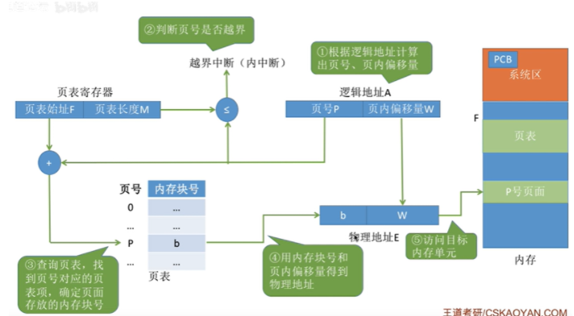
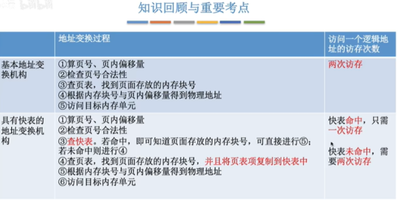

## 3.1.1

这一节讲了程序到运行过程中 做了什么 最后这一节被完之后在学习。

## 3.1.2

## 3.1.6

1.在os内存管理中的第一条`实现对内存的分配和回收`中，非连续分配管理方式有哪三种？
2.讲一下分页存储的思想，大致流程。区分好页、页面、页框、内存块。
3.实现逻辑地址到物理地址转换的思路。

## 3.1.7

1.计算机内部，实现逻辑地址到物理地址转换的过程。(也可以通过下面3.1.8的表格来记忆)

2.CPU访问几次内存，分别为什么。

## 3.1.8

1.引入快表之后实现地址转换的过程的大致情况：

2.局部性原理

