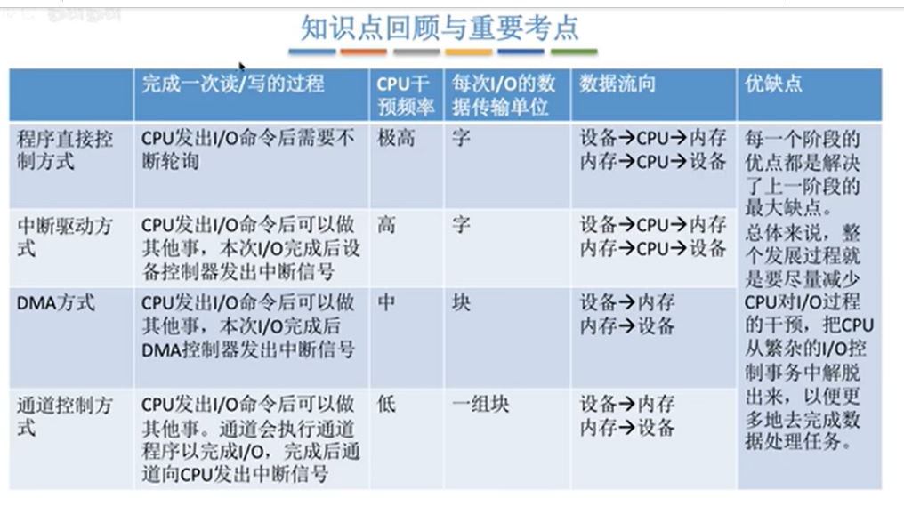
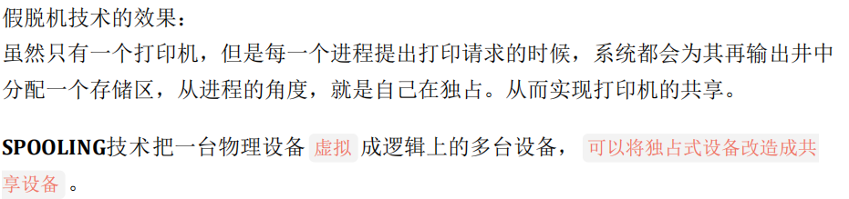

1.IO控制方式：

通道的速度很快，但是价格比较昂贵。

2.脱机技术的思想，假脱机的作用。

3.为什么要设置缓冲区，缓冲区的作用

4.磁盘的结构
磁片 磁面 磁道 柱面 扇区 磁头 磁头臂。
交替编号，错位命名，地址结构设计(柱面，盘面，扇区)

5.磁盘读写时间：
 = 寻道时间 + 延迟时间（磁头定位到对应的扇区） + 读写时间

6.磁盘寻道算法：

扫描算法：
只有到最两侧 才能改变方向。

7.SPOOLING技术：
虚拟性是OS的四大特性之一。如果说可以通过多道程序技术将一台物理CPU虚拟为多台逻辑CPU，从而允许多个用户共享一台主机，那么，通过SPOOling技术便可将一台物理I/O设备虚拟为多台逻辑I/O设备，同样允许多个用户共享一台物理I/O设备。

SPOOLing技术是对脱机输入、输出系统的模拟。相应地，SPOOLing系统必须建立在具有多道程序功能的操作系统上。

SPOOLing系统主要有以下三部分：

（1）输入井和输出井。这是在磁盘上开辟的两个大存储空间。输入井是模拟脱机输入时的磁盘设备，用于暂存I/Q设备输入的数据；输出井是模拟脱机输出时的磁盘，用于暂存用户程序的输出数据。

（2）输入缓冲区和输出缓冲区。为了缓和和CPU和磁盘之间速度不匹配的矛盾，在内存中要开辟两个缓冲区；输入缓冲区和输出缓冲区。输入缓冲区用于暂存由输入设备送来的数据，以后再传送到输入井。输出缓冲区用与暂存从输出井送来的数据，以后在传送给输出设备。

（3）输入进程SPi 和输入进程SP0。这里利用两个进程来模拟脱机I/O时的外围控制机。其中，进程SPi模拟脱机输入时的外围控制机，将用户要求的数据从输入机通过输入缓冲区再送到输入井，当CPU需要输入数据时，直接从输入井读入内存；**进程SP0模拟脱机输出时的外围控制机，把用户要求输出的数据从先内存送到输出井，待输出设备空闲时，在将输出井中的数据经过输出缓冲区送到输出设备上。**

SPOOLing技术的特点：

(1)提高了I/O速度。从对低速I/O设备进行的I/O操作变为对输入井或输出井的操作，如同脱机操作一样，提高了I/O速度，缓和了CPU与低速I/O设备速度不匹配的矛盾。

(2)将独占设备改造为共享设备。因为在SPOOLing系统的系统中，实际上并没为任何进程分配设备，而知识在输入井或输出井中为进程分配一个存储区和建立一张I/O请求表。这样，便把独占设备改造为共享设备。

(3)实现了虚拟设备功能。多个进程同时使用一独享设备，而对每一进程而言，都认为自己独占这一设备，从而实现了设备的虚拟分配。不过，该设备是逻辑上的设备。
