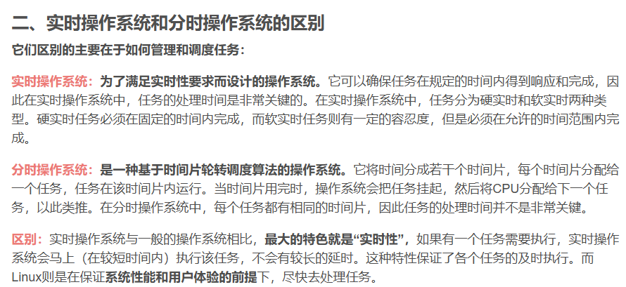

1.OS的作用，四个特性。

操作系统是计算机资源的管理者。主要有处理机管理、存储管理、设备管理、文件管理。此外，操作系统还为用户提供使用操作系统硬件系统的接口，分别是命令接口、程序接口、图形接口。操作系统的四个基本特征是并发、共享、异步、虚拟。

2.什么是多道程序设计。

多道程序设计：允许多个程序（作业）同时进入一个计算机系统的内存并启动进行交替计算的方法，也就是，计算机中可以同时存放多道程序，从宏观上来看它们是并行的，多道程序都同时处于运行过程中，但都未运行结束，但是微观上是串行的，轮流占用CPU交替执行。

3.引入多道程序设计的目的。

引入多道程序设计技术的根本目的是提高CPU的利用率，充分发挥计算机系统部件的并行性。

4.为什么要引入进程。
引入了进程的概念，以便更好地描述和控制程序的并发执行，实现操作系统的并发性和共享性。

5.实时操作系统和分时操作系统简介和区别

6.

> 什么是中断，中断的作用：
> 中断即打断，实至CPU再执行当前程序时，由于系统出现了某种需要处理的紧急情况，CPU暂停正在执行的程序，转而去执行另一段特殊程序来处理的出现的紧急事务，处理结束后CPU自动返回到原先暂停的程序中去继续执行，这种执行过程由于外界的的原因被中间打断的情况成为中断。
> 中断的作用：
> 中断使得计算机系统具备应对对处理突发事件的能力，提高了CPU的工作效率，如果没有中断系统，CPU就只能按照原来的程序编写的先后顺序，对各个外设进行查询和处理，即轮询工作方式，轮询方法貌似公平，但实际工作效率却很低，却不能及时响应紧急事件。

7.中断的简介：

所以内核态->用户态的切换，就是运行一条指令，使得PSW变化为用户态。
用户态->内核态：由'中断'引发，硬件自动完成变换状态，触发中断信号内核会强行夺回CPU使用

中断的类型：内中断和外中断。
内中断：与当前指令有关，中断信号来源于cpu内部。(比如缺页) 也称为异常
外中断：与当前指令无关，中断信号来源于cpu外部。(比如时间片轮转中下cpu)

找到了中断信号之后，借助中断向量表，找到对应的中断处理程序。

8.系统调用简介：
**系统调用：**
是os提供给应用程序使用的接口，可以理解为一种可以让应用程序调用的特殊函数。**应用程序可以通过系统调用来请求操作系统内核的服务。**

为什么需要系统调用：
操作系统的内核对`共享资源`进行统一的管理，并且往上面提供系统调用。因此对于用户进程，想要使用共享资源，只能通过系统调用向os内核发出请求，然后内核会对各个请求进行协调处理。

如果没有系统调用，两个用户都要打印，就直接打印了，没有经过os内核的统一调度。会乱。

9.开机之后，系统做了什么事情？

